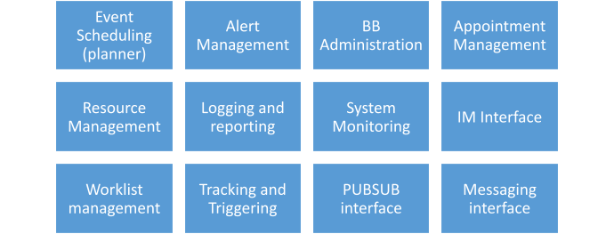

# 6 Functional Requirements

## Internal functional blocks :

A common set of unique internal functional requirements to orchestrate the services of the scheduler BB derived from the use cases above, can be grouped into logically separate internal subblocks as shown below. The REST APIs defined in appendix-1 route service requests to appropriate internal

<figure><figcaption></figcaption></figure>

blocks and format responses from results collated across relevant internal blocks. A brief description of the generic functionality of each of these blocks has been given below from a minimum viable product perspective. Detailed design and feature lists of these blocks can be customized by developers to optimally match specific target needs.

### I. Event Scheduling(planner):&#x20;

This sub-block can create/update/cancel sessions and add them to specific episodes within an Event. To facilitate planning, tracking, and triggering specific alerts needed for driving the activities as per schedule, this subblock maintains a worklist that captures details of all scheduled events including list of resources allocated and subscribers booked for the session. It enables listing of sessions, episodes, events, resources, subscribers with different filter options. IT can also search for specific type of resources of a given entity, which are unallocated during a given date-time range, and to find timeslots in a given date-range where all specified resources are unallocated. All event related information is stored in the worklist sub-block.

### II. Worklist management :

This sub-block maintains records of all event schedules, including date-time slots of all resources, and subscribers of each session, episode and event, along with schedule of associated alerts to be generated before/during/after for each session. The planner may add/cancel worklist entries, the Tracking subblock may use this worklist to track and generate alerts appropriately.

### III. Resource Management:

This block can register, update and list resources including personnel, equipment, vehicles, facilities\[1] \[2] , etc. The block also enables non-duplication of subscriber and resource entries and captures details of each resource such as communication addresses, owner entity, resource type, etc. The scheduler automatically populates new resources with details as and when encountered within requests of various sessions which can then be reused to schedule participation in multiple sessions, episodes and subsequent events based on implementation needs. Each resource may be tagged to a specific type  (doctor, nurse, ambulance, equipment, etc.) and there can be resources of same type, each with different ID.

### IV. Appointment\[1] \[2]  Management:

This subblock facilitates booking of subscribers into specific sessions, episodes and events posted on the Scheduler(Worklist). It provides utilities for discovery of event details, available session slots, and captures subscriber enrolment details into specific events. It generates unique tokens for subscriber appointments in respective sessions of the event. In use cases where the subscriber is a target device/software, the admin of this BB  is expected to configure the subscription and associated Alerts in the event schedule. It is to be noted that event management is to do with planning and running an event and appointment management is to do with enrolment of beneficiaries of an event. This module also provides APIs to check status, cancel or reschedule respective appointments.

### V. Alert Management:

This subblock enables creation, updated and binding of message templates that can be used in various notifications required by an Event Schedule. The sub-block also enables categorization of alert types such as reminders, activity triggers, status notifications, etc and allocated standardized timing of alters such as a day/hour/min before or at onset of an event, repeat interval, etc., which helps reuse notifications for various subscribers and resources of a session. The subblock expects appropriate UI inputs from the administrator for configuration of Alert templates.

### VI. Schedule Tracking and triggering: 

This block continuously monitors the worklist for onset of various alert and generates appropriate alert messages to trigger appropriate target users and systems at appropriate times, based on the event schedule. It will run as an independent process thread with capability to track thousands of parallel events and generate heterogenous notifications. This block shall be configured to send messages through IM directly to a target BB, or publish it in its local IM+PUBSUB module  or through messaging BB, and in either case  receive token number status notifications (for example an event was started, ended or no show). Details logged by this sub-block should be used by the reporting subblock to generate appropriate indicators and for seeking status updates.

### VII. BB Administration**:**

This subblock provides control over all functionality and their configurations to the BB administrator. For example, registered users of the system can be enabled/disabled from using specific features of the BB. This block also enables the administrator to setup rules for automatic status polling, report generation, configure rules to  send notifications confirming creation/modification/cancellation of events  or not when forced by the administrator. It also enables the administrator to setup the interface parameters  (such as URLs) to interact with specific external blocks (such as messaging, workflow, etc.). It also configures alert rules for any performance/security conditions that need to be escalated to the administrator proactively. It can be used to configure communication requirements such as back-off mechanism, error handling, network breakdown resilience mechanisms, latency limits, setup/update/Log system monitoring parameters, etc. This sub-block provides a presentation (UI) layer and controlled access administrative users of this BB. This subblock orchestrates all the protocols  and interface necessary to interact with API gateway and Internet access management functions of the Security Building Block to enable authenticated user access. This block also provides the bridge to route data exchange between Administrator requests (such as configuration forms) to reach the various BB subblocks and route responses (such as reports, etc.).  from BB sub-blocks to a front end UI, the actual configuration parameters is a design time choice.  Based on traffic and performance requirements, such a bridge can also be a separate sunblock. However, the actual choice may be a consideration during design time.

### VIII. Logging and Reporting:

This subblock maintains logs of user driven transactions, activities originated from this BB as well as status updates coming from external sources. All logs contain a date time stamp, an optional location stamp, details of information source and the status of transaction. For example, the Scheduler can log all alerts its generates and all events that are created/updated/cancelled. It can also log external status such as completion of a consultation session or no show from another application that tracks delivery of specific services in an event. In some implementations, some subscriber users or systems may also generate acknowledgement of having received triggers/notifications from the scheduler within a certain period of time, failing which a rule may force the scheduler to resend the trigger/notification for a given number of retries before logging a communication success or failure. The System monitoring block can also log latency and utilization status as to how close is the event traffic load compared to the system capacity. The security implementation of the BB may also log any security threats or faults detected in the system. This subblock also generates different types of pre-configured reports and emit them in response to specific queries over a chosen date range. The block enables formation of report templates  through selection of parameters from logs. The reports may be generated on demand or at a configurable frequency. The scheduler does not need to retain copies of reports generated, except for logging what reports were generated by whom and when, as it can recreate the same from data whenever needed. Preconfigured templates can be created to save time and add flexibility in report generation. While this subblock can be designed to generate various types of reports, a minimum set of reports maybe predefined to help monitoring and auditing the scheduler building block for performance, Schedule compliance, transactional status, and statistical indicators spanning across events.

### &#x20;IX. System Monitoring:

This sub-block is mean to monitor internal processes of the Scheduler building block and log certain parameters that may help in housekeeping and capacity management. For example, since the scheduler responds to multiple users,  tracks multiple event schedules and triggers multitude of messages and acquires several responses from target systems, may apply queuing mechanisms internally as needed, it should also log typical latency, queue depth, errors, system resource consumption, retries, etc. that may form critical indicators for how the performance of the scheduler building block is going. This sub-block provides configurability to administrators to select specific parameters to track at regular intervals. These measurements will be used by the reporting block to generate meaningful trends and alerts as needed for capacity and performance management.

### &#x20;X. IM Interface:

This sub-block runs protocols to communicated through information mediator BB for external BBs and applications to use the scheduler building block services. It also provides specific API abstraction needed to access services from external applications and building blocks. It also handles any errors and failures in data exchange between the scheduler and other BBs/Apps and routes appropriate information to the logger subblock. It maintains a list of IM and endpoint addresses of external BBs and Applications and updates it with inputs from the  Administrative sub-block from time to time as needed.

### &#x20;XI. Pubsub interface:

This block maintains end point address of specific rooms dedicated to the scheduler Building block to publish Alert notifications. This block  handles receiving notifications from PUBSUBs of other building blocks (such as messaging, Accounting, payments, etc) to get and route status updates upon onset of their respective events. (for example to update completion status of an ongoing event). The PubSub sends appropriate status information to the logging sub block to maintain history of PubSub transactions handled by Scheduler BB.

### &#x20;**XII.** Messaging interface:

The messaging interface provides the necessary protocol, data format and information to interact with the messaging building block for sending of notifications to specific target users / applications through a variety of channels (SMS/email/Webhooks/etc.) This block also routes response messages from target users/applications to schedule tracker for triggering specific internal actions. It sends relevant information to the logging subblock to maintain history of all messaging transactions of this building block, which are useful for audit purposes. It should be noted that the messaging interface does not employ any specific mechanism to actually send messages to the end points.

## Out of scope: 

Evaluation of any criteria other than time-based evaluations for generation of a trigger. The scheduler can be used to trigger activities based on time only. The triggered applications or BBs may implement their own logic to evaluate other conditions before action. (e.g., an Accounts BB may get triggered every month by the Scheduler, but it may check if an approved payroll is available before initiating payments). This exclusion also applies to alerts based purely on human decision.
