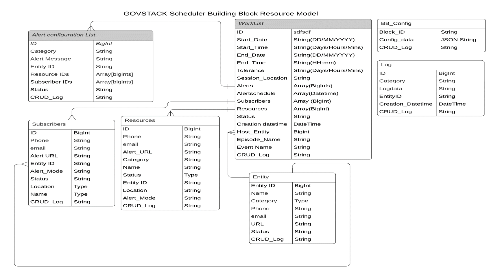

# 7 Data Structures

The scheduler BB stores all sessions in an internal worklist. Each session may for specific activity (consultation, therapy, payroll, training, etc.) delivered by one or more resources (personnel/facility/etc.), targeting one or more subscribers(people/BBs/machines). A Session may need multiple Alerts (such as reminders,   information, announcements, instructions, triggers, etc.) to be sent to subscribers and resources at appropriate times before, during and after a session. The notifications may also embed information to help receiving party in taking specific action. To simplify scheduling multiple sessions that happen on same day, with same resources and activity but targeting different subscribers, the scheduler enables multiple sessions to be grouped into a single Episode (for example a “consultation” episode could host several consultation sessions with different patients). Further, an “Event” can host multiple episodes that occur over a span of multiple days. The building block maintains details of all schedules and associated resources, subscribers, alerts and allocated date-times in a “worklist” in terms of sessions stacked into episodes and events.  For example, an education institution may conduct a course (Event) involving repeated training on subjects on different days(Episodes), each day having multiple training (sessions) involving different batches of students. Similarly, to carry out “settlements”( event) on a monthly basis (Episode), a payroll session and payments sessions are triggered on accounting building blocks. A clinic could plan a medical camp(event) spanning several days, with daily episodes consisting of several medical consultation and screening (sessions), for number of patients(Subscribers).

The data requirements of these heterogenous use cases are reduced into a comprehensive set of unique data elements, organized into a schema of common reusable datasets, formed by grouping of closest related data elements, avoiding unnecessary duplication.  In this model, the basic unit of scheduling is an “Session“.  All sessions have unique IDs that link to corresponding entry in a internal calendar of the Scheduler. The API structure that defines the service interface should accommodate various fields relevant across use cases that may consume the service. However, some fields many be filled mandatorily while others may be optional depending on the use case. Also, all details of a data set in the data model may not be populated at once, it may be filled in parts as and when relevant (e.g., although a consultation session may be provisioned, but consumers may be appointment later). As new use cases are discovered, one can add fields that are not in the set in the model already. It is assumed each use case will define respective  subset of data model along with mandating of appropriate data fields.  Besides the basic data set needed for scheduling, there are data sets such as configurations, etc., that help to administer and audit the scheduler BB itself (e.g, Security, performance, Transactional and Schedule Compliance audit reports, etc.) The proposed resource model showing the relationship between data objects that are used by this Building Block is illustrated in the diagram below.  Support of polymorphic data sets and data types is provided by means of a list of generic meta-attributes, to enable Polymorphism in data-sets which may occur when different collections inherit common data from base entities.

## Standards

Typical data structure requirements and format representations relevant to this building block have been TMF646\_Appointment\_API\_Specification\_R19.0.0\_fixed ([https://www.scribd.com/document/448516776/TMF646-Appointment-API-Specification-R19-0-0-Fixed](https://www.scribd.com/document/448516776/TMF646-Appointment-API-Specification-R19-0-0-Fixed)). However, the schema and data elements are optimized for minimizing footprint and external dependencies, given that this building block handles time-critical alerts.

## Scheduler Building Block Resource Model

<figure><figcaption>
<a href="https://lucid.app/lucidchart/309762a7-1c77-43ce-8f1f-d5f27be6c782/edit?invitationId=inv_51a931a4-75d0-441e-94f5-3f254d223520">https://lucid.app/lucidchart/309762a7-1c77-43ce-8f1f-d5f27be6c782/edit?invitationId=inv_51a931a4-75d0-441e-94f5-3f254d223520</a>
</figcaption></figure>

### Data elements

| Worklist             | ID                                                                                                        | Unique ID of a specific session                                  |
| -------------------- | --------------------------------------------------------------------------------------------------------- | ---------------------------------------------------------------- |
| Start\_Date          | Starting date of the session                                                                              |                                                                  |
| Start\_Time          | ending date of the session                                                                                |                                                                  |
| End\_Date            | Starting time of the session                                                                              |                                                                  |
| End\_Time            | ending time of the session                                                                                |                                                                  |
| Tolerance            | Duration in days,hours,mins to wait beyond scheduled start date time before concluding session as no show |                                                                  |
| Session\_Location    | GPS coordinates and address of the location from where session is delivered                               |                                                                  |
| Alerts               | List of alert IDs that link to specific alert messages and associated details for this session            |                                                                  |
| Subscriber IDs       | List of Subscriber IDs that have booked appointment for this session                                      |                                                                  |
| Resource IDs         | List of resource  IDs that have been allocated for this session                                           |                                                                  |
| Status               | Latest updated status of this session(inactive/pending/triggered/in progress/completed/failed/etc)        |                                                                  |
| Host\_Entity         | ID of the entity which hosts this session                                                                 |                                                                  |
| Creation datetime    | When this session was created                                                                             |                                                                  |
| Episode\_Name        | Name tag of the Episode to which this session belongs                                                     |                                                                  |
| Event\_Name          | Name tag of the Event to which this session belongs                                                       |                                                                  |
| CRUD\_Log            | History of transactions done on configuration of this session entry                                       |                                                                  |
| Session name         | Name of this session                                                                                      |                                                                  |
| Subscriber limit     | Max number of subscribers that this session can accommodate                                               |                                                                  |
| Session Charges      | Amount                                                                                                    |                                                                  |
| Currency             | Currency of charges                                                                                       |                                                                  |
| Terms and conditions | Terms and conditions to be accepted by subscriber                                                         |                                                                  |
| instructions         | Instructions to be followed by sucbscriber and resources                                                  |                                                                  |
| Log                  | Log\_ID                                                                                                   | Unique identifier of a specific transaction                      |
| Category             | Unique identifier of a specific type of transaction  (Based on what change did the administrator affect)  |                                                                  |
| Log\_data            | Transaction summary                                                                                       |                                                                  |
| Entity ID            | Entity of person who did this transaction                                                                 |                                                                  |
| Creation Datetime    | When this log was created                                                                                 |                                                                  |
| CRUD\_Log            | Details of transaction done and who did it                                                                |                                                                  |
| BB Config            | Block\_ID                                                                                                 | Name of internal block which is to be configured                 |
| Config\_data         | Latest Configuration settings of various parameters in this block given in JSON format                    |                                                                  |
| CRUD\_Log            | ID of user and application which did any CRUD transaction                                                 |                                                                  |
| Alert List           | ID                                                                                                        | Unique identifier of a specific alert message bound to a session |
| Category             | Type of alert message (appointment alert/ process trigger/ healthalert/crimealert/etc.)                   |                                                                  |
| Entity ID            | Entity which owns this alert message                                                                      |                                                                  |
| Target Resources     | Unique identifiers of specific Resources enrolled in a specific session                                   |                                                                  |
| Target Subscribers   | Unique identifiers of a specific subscribers enrolled in a specific session                               |                                                                  |
| Epoch                | Date-Time when this alert must be generated                                                               |                                                                  |
| AlertMessage         | Alert message to be sent (Common to all recipients)                                                       |                                                                  |
| Status               | Status of alert (pending/sent/delivered)                                                                  |                                                                  |
| CRUD\_Log            | Configuration history of this Alert entry                                                                 |                                                                  |
| Resources            | ID                                                                                                        | Unique identifier of a specific Resource                         |
| Phone                | Resource phone number                                                                                     |                                                                  |
| Email                | Resource email address                                                                                    |                                                                  |
| Alert\_URL           | Resource URL to send alerts                                                                               |                                                                  |
| Category             | Identifies the resource class e.g doctor, nurse, admin, ambulance,etc.                                    |                                                                  |
| Name                 | Name of resource                                                                                          |                                                                  |
| Entity               | Organization which owns this resource                                                                     |                                                                  |
| Location             | Address of the resource                                                                                   |                                                                  |
| Alert\_Mode          | Whether alert should be sent to this resource by mail/phone/messaging/URL                                 |                                                                  |
| CRUD\_Log            | Configuration history of this Resource entry                                                              |                                                                  |
| Status               | Status of this resource (enabled/disabled)                                                                |                                                                  |
| Subscribers          | ID                                                                                                        | Unique identifier of a specific subscriber                       |
| Phone                | Subscriber phone number                                                                                   |                                                                  |
| Email                | Subscriber email address                                                                                  |                                                                  |
| Alert URL            | Subscriber URL to send alerts                                                                             |                                                                  |
| Entity               | Organization that the subscriber represents (subscriber may be individual participants also).             |                                                                  |
| Alert\_Mode          | Whether alert should be sent to this subscriber by mail/phone/messaging/URL                               |                                                                  |
| CRUD\_Log            | Configuration history of this Subscriber entry                                                            |                                                                  |
| Status               | Status of this subscriber(Enabled/disabled)                                                               |                                                                  |
| Location             | Address of subscriber                                                                                     |                                                                  |
| Entity               | ID                                                                                                        | Unique identifier of a Entity                                    |
| Category             | Class of entity (Hospital, clinic,etc)                                                                    |                                                                  |
| Name                 | Name of entity                                                                                            |                                                                  |
| Phone                | Phone number of the entity                                                                                |                                                                  |
| Email                | Email of the entity                                                                                       |                                                                  |
| Status               | Whether this entity is active or not for scheduling                                                       |                                                                  |
| CRUD\_Log            | Transaction history of this document                                                                      |                                                                  |
