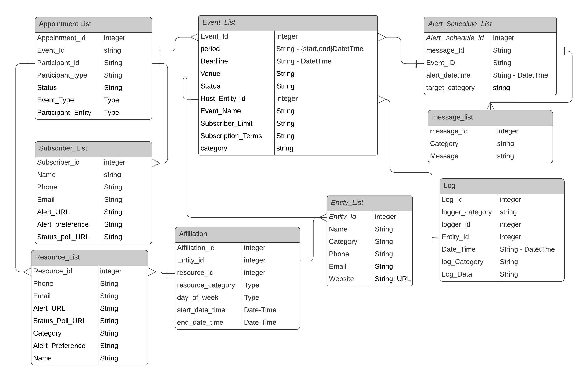

# 7 Data Structures

The proposed resource model showing the relationship between data objects that are used by this Building Block is illustrated in the diagram below. The Scheduler Building Block stores details of Events in EventList, Resources in a ResourceList, Subscribers in SubscriberList, Alert message templates in an AlertList, alert schedules in an AlertScheduleList, entities in EntityList and Affiliations of resources in entities in the AffiliationList. Entries in this list include properties of respective items and linkages between them Apart from these, the Scheduler has several "internal" registers that are used to log information arising from transactions, from the system, from communications, etc., and metrics/indicators as needed for housekeeping, audit, and administration of the Building Block. The archival and retrieval mechanisms for data generated or received in the Scheduler Building Block are left to implementation time considerations of IT infrastructure planning.

## 7.1 Resource Model

<figure><figcaption>
<a href="https://lucid.app/lucidchart/309762a7-1c77-43ce-8f1f-d5f27be6c782/edit?invitationId=inv_51a931a4-75d0-441e-94f5-3f254d223520&#x26;page=0_0">Schema Source</a>
</figcaption></figure>

### 7.2 Data elements

**7.2.1 Group: EventList**

| Name            | Type                    | Description                                                                                                                                                                                                            |
| --------------- | ----------------------- | ---------------------------------------------------------------------------------------------------------------------------------------------------------------------------------------------------------------------- |
| EventId         | String                  | unique id of the event                                                                                                                                                                                                 |
| EventName       | String                  | title of event                                                                                                                                                                                                         |
| Description     | String                  | Brief introduction of the event                                                                                                                                                                                        |
| From            | Date (dd/mm/yyyy/hh/mm) | when event will start                                                                                                                                                                                                  |
| To              | Date(dd/mm/yyyy/hh/mm)  | when event will start                                                                                                                                                                                                  |
| Deadline        | Date (dd/mm/yyyy/hh/mm) | If participant does not update attendance to Scheduler within this deadline after an event starts, the participant is marked as a no-show. If all participants are in no-show status then the event status is no-show. |
| Venue           | Object                  | Location and address of the event                                                                                                                                                                                      |
| Status          | String                  | pending/started/completed/no-show/etc.                                                                                                                                                                                 |
| HostEntityId    | Integer                 | id of the entity which is organizing the event                                                                                                                                                                         |
| Event Name      | String                  | name may show event type and branding                                                                                                                                                                                  |
| SubscriberLimit | String                  | Maximum number of subscribers allowed                                                                                                                                                                                  |
| Terms           | String                  | Any conditions and instructions for to subscribers for participation in an event                                                                                                                                       |
| Category        | string                  | category of the event (e.g. consultation, training, salary payments, etc.)                                                                                                                                             |

**7.2.2 Group: Appointment LIst**

<table><thead><tr><th width="171">Name</th><th width="100">Type</th><th>Description</th></tr></thead><tbody><tr><td>Appointment_Id</td><td>String</td><td>unique id of entity</td></tr><tr><td>Exclusive</td><td>Boolean</td><td>if true, appointment date-time slot cannot overlap  with another appointment of same person (e.g. a machine may service multiple events at same time, but not a surgeon)</td></tr><tr><td>EventId</td><td>String</td><td>name of entity</td></tr><tr><td>Participant_Type</td><td>String</td><td>hospital/clinic/bank/etc.</td></tr><tr><td>Participant_Id</td><td>String</td><td>default phone number</td></tr><tr><td>Status</td><td>String</td><td>default email id</td></tr><tr><td>Participant_Entity_Id</td><td>String</td><td>affiliated entity of participant</td></tr></tbody></table>

#### 7.2.3 Group: EntityList

| Name     | Type   | Description               |
| -------- | ------ | ------------------------- |
| EntityId | String | unique id of entity       |
| Name     | String | name of entity            |
| Category | String | hospital/clinic/bank/etc. |
| Phone    | String | default phone number      |
| Email    | String | default email id          |
| Website  | URL    | URL of website of entity  |

#### 7.2.4 Group: Address

| Name          | Type   | Description        |
| ------------- | ------ | ------------------ |
| Building Name | String | Name of Building   |
| Street        | String | Name of the Street |
| Locality      | String | Name of Locality   |
| District      | String | Name of District   |
| State         | String | Name of State      |
| Country       | String | Name of Country    |

#### 7.2.5 Group: ResourceList

| Name            | Type   | Description                                                                                          |
| --------------- | ------ | ---------------------------------------------------------------------------------------------------- |
| ResourceId      | String | Unique ID of a specific Resource                                                                     |
| Phone           | String | contact phone on which this resource receives alerts by sms/etc                                      |
| Email           | String | contact mail id on which this resource receives alerts                                               |
| AlertURL        | URL    | webhook address on which this resource receives alerts                                               |
| StatusPollURL   | URL    | URL endpoint at which this Resource will report status of alert it received when queried             |
| Category        | String | profession of this resource (Doctor/nurse/mechanic/teacher/etc.)                                     |
| AlertPreference | String | which channels (sms/email/webhook/etc) are preffered for alerting this resource in order of priority |
| Name            | String | proper name of the Resource (person/facility/vehicle/equipment)                                      |

#### 7.2.6. Data Group: AffiliationList

| Name             | Type                            | Description                                                                                                 |
| ---------------- | ------------------------------- | ----------------------------------------------------------------------------------------------------------- |
| AffiliationId    | String                          | Entity to which a Resource is affiliated                                                                    |
| ResourceId       | String                          | Working days and time zones that a specific resource allocated to work in an affiliated entity              |
| EntityId         | String                          | IDs of one or more events a resource is bound to within work hours of the resource in the affiliated entity |
| ResourceCategory | String                          | doctor/healthworker/application/device/etc.                                                                 |
| WorkDaysGours    | Array\[weekday,start, end time] | weekly days and time zones a resource is affiliated to work in a given entity                               |

#### 7.2.7 Group: SubscriberList

| Name            | Type   | Description                                                                                             |
| --------------- | ------ | ------------------------------------------------------------------------------------------------------- |
| SubscriberId    | String | Unique ID of a specific person as a Subscriber                                                          |
| Phone           | String | contact phone on which this Subscriber receives alerts by sms/etc.                                      |
| Email           | String | contact mail id on which this Subscriber receives alerts                                                |
| AlertURL        | URL    | webhook address on which this Subscriber receives alerts                                                |
| StatusPollURL   | URL    | URL endpoint at which this Subscriber will report the status of the alert it received when queried      |
| AlertPreference | String | which channels (sms/email/webhook/etc.) are preferred for alerting this Subscriber in order of priority |
| Name            | String | proper name of the Subscriber                                                                           |
| Category        | String | (person/facility/vehicle/equipment)                                                                     |

#### 7.2.8 Group: AlertScheduleList

| Name            | Type   | Description                                       |
| --------------- | ------ | ------------------------------------------------- |
| AlertScheduleId | String | unique id of this schedule for a specific alert   |
| MessageId       | String | specific alert message template to be sent        |
| EventID         | String | the event to which this alert chedule is bound to |
| AlertDateTime   | Date   | Date time at which this alert is to be sent       |
| TargetCategory  | String | who should be alerted Subscribers/resources/both  |

**7.2.9 Group: MessageList**

| Data Element | Default format | Description                                        |
| ------------ | -------------- | -------------------------------------------------- |
| MessageId    | String         | specific alert message template                    |
| Category     | String         | (e.g. info/status/acknowledgement/ emergency/etc.) |
| EntityId     | String         | Host Entity which owns this message template       |
| MessageBody  | String         | content of alert message                           |

**7.2.10 Group: LogList**

| Name        | Type                    | Description                                                       |
| ----------- | ----------------------- | ----------------------------------------------------------------- |
| LogId       | String                  | unique id of this log entry                                       |
| EntityId    | String                  | entity logging this data                                          |
| DateTime    | Date (dd/mm/yyyy/hh/mm) | when this log was entered                                         |
| LoggerId    | Integer                 | id of the resource/subscriber/etc.                                |
| LoggerRole  | String                  | resource/subscriber/internal/etc.                                 |
| LogCategory | String                  | parameter which is logged (e.g. latency/communication error/etc.) |
| LogData     | String                  | Content of Log                                                    |

**7.2.11 Group: FreeResources**

| Name         | Type                                 | Description                                                                |
| ------------ | ------------------------------------ | -------------------------------------------------------------------------- |
| ResourceId   | String                               | Unique id of resource                                                      |
| ResourceName | String                               | Name of resource                                                           |
| FreeSlots    | Array(start\_datetime,end\_datetime) | List of free slots of this resource (start and end date-time of all slots) |

#### 7.2.12 VenueDetails

| Name     | Type    | Description                    |
| -------- | ------- | ------------------------------ |
| VenueId  | String  | Unique ID for this venue       |
| Building | String  | name of venue                  |
| Street   | String  | cross/main road                |
| Area     | String  | name of area                   |
| City     | String  | name of town/city              |
| State    | String  | name of state                  |
| Country  | String  | name of country                |
| Lat      | String  | latitude of building location  |
| Long     | String  | longitude of building location |

### 7.3 Notes on the Data Model

The internal storage of the Scheduler Building Block MUST hold configuration, status, and logged information of all scheduled events. It MUST also maintain a repository of details of resources and subscribers affiliated with various events

The internal data requirements of the Scheduler operations from heterogenous use cases can be reduced into a comprehensive set of unique data elements, organized into a schema of common reusable datasets, formed by a grouping of closest related data elements, avoiding unnecessary duplication.

In this model, the basic unit of Scheduling is an “Event“, each Event has a unique ID. The API structure that defines the service interface should accommodate various fields relevant across use cases that may consume the service. Some fields may be mandatory inputs while others may be optional depending on the use case.

All details of a data set in the data model may not be populated at once, it may be filled in parts as and when relevant (e.g. although a consultation session may be provisioned, consumers may be appointed later).

As new use cases are discovered, one can add fields that are not in the set in the model already. It is assumed each use case will define the respective subset of the data model along with the mandating of appropriate data fields.

Besides the basic data set needed for scheduling, there are data sets such as configurations, etc., that help to administer and audit the Scheduler Building Block itself (e.g, Security, performance, Transactional and Schedule Compliance audit reports, etc.).

Support of polymorphic data sets and data types is provided by means of a list of generic meta-attributes, to enable Polymorphism in data sets which may occur when different collections inherit common data from base entities.
