# 9 Workflows

In current scope, example drawn from user-journey steps of use-cases of Post-Partum care and Unconditional Social Benefit transfer programs were considered to derive key digital functionalities required to orchestrate services from this Building Block. In this section we identify workflows to manifest some of the main services. These may be enhanced or customized as needed for specific implementation needs.The following common preconditions may be needed to be met before utilizing these services:

* Entities that Host an Event registered in the Scheduler before scheduling respective events;
* Subscriber, Organizer, and Resources are registered in Scheduler before being used in Event;
* Service Endpoints of Scheduler and other Building Blocks it will interact with are already configured in Information Mediator Building Block;
* All users are logged into GovStack Host application to do their respective tasks;
* Subscriber/Organizer knows preferred host entity, event category to search for resources and available events;
* Any payments associated with event subscription are done outside of the Scheduler;
* Records of the latest resource and subscriber contact details stored in the Scheduler are up-to-date;
* Target Building Block is registered as publisher and Scheduler is registered as a subscriber in “status” room of Information Mediator Building Block Pub/Sub dedicated to the target Building Block before using Pub/Sub mode for status updates/triggers;
* Event schedule with a unique ID already exists in Scheduler before seeking cancellation update;
* Scheduler can also call some of its APIs from inside for operations that do not need external interaction in a particular workflow if the information is already available internally.

This section captures the analyzed workflows that take place within these key functionalities for a minimum viable product as follows&#x20;

* Event creation;
* Finding resources of a host entity which are available in a given date-time range;
* Allocating resources to a specific event;
* Finding event slots of a given category and resource Id in a given date-time range;
* Appointment Scheduling for resource or subscriber to a specific event;
* Cancellation of appointment;
* Registering new Alert Message Template;
* Scheduling Alerts for a given event;
* Tracking and Alerting as per schedule;
* Cancellation of scheduled event;
* Log Reporting;
* Registering a new entity;
* Registering a new resource;
* Affiliating an existing resource to a new entity;
* Registering a new subscriber.

### Workflow sequence diagrams

The workflows mentioned above are represented in sequence diagrams as illustrated as examples below. As defined earlier, the scheduler responds to four types of actors:

* Building Block admins who configure the Building Block's functional aspects, monitor and administer the performance of the Building Block in live environments. (This is an implementation detail and not discussed in the scope of the workflows below).
* Resource who is affiliated to one or more entities and gets allocated to specific events to carry out some activities.
* Subscribers who are enrolled in one or more events as a beneficiary of the event. Subscribers may be individuals or represent some entity.
* Organizer who can manage the configuration of events, resources, alerts, and subscribers.

****

1. **Event Creation**

An organizer can use this workflow to create a new event in the system. The Organizer will need to feed in minimum details such as the event name, category, address, start and end date-time, host entity, terms for subscription, and subscription limit (e.g. a doctor consultation event is limited to one patient. In a training event the limit may include multiple students. Optionally, a deadline may be fed in for participants to log attendance to the event (else marked as absent). This workflow allows organizer to feed in a list of resources and subscribers  already registered (old members) for enrollment into the new event. The Scheduler checks for non-duplication of given event and that the given entity/resource/subscriber ids are already registered members before registering the event details in its Event\_List. It then returns either an error code or success status along with a unique event id to host application of organizer.&#x20;

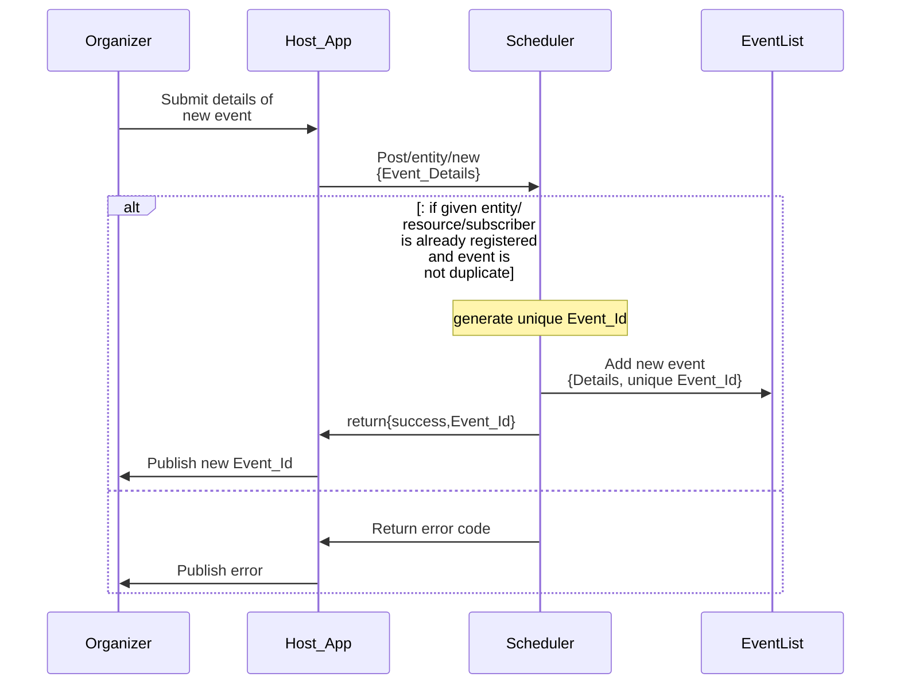

#### 2. Finding resources of a host entity that are available in a given date-time range&#x20;

An organizer may need to find availability of resources (personnel, equipment, vehicles, facilities, etc.) of a specific entity to enroll into a specific event.  The organizer seeks the scheduler through a host application, free time zones of specific list of resources of a specific entity, within a date range. The Scheduler fetches from its Resource\_List the workdays-hours of specified resources in a given entity. Alternatively the organizer may feed resource category instead of specific resource Id. In that case, the Scheduler fetches resources of given category and entity along with respective workdays-hours from its Resource\_List.  Then for each resource, the Scheduler then fetches in the Event\_List the periods of various events having the resource falling within the given date-time range. The Scheduler further calculates available free time zones within the workdays-hours affiliated to each resource. Finally, the Scheduler returns a list of resources with respective unallocated date-time slots. The host application presents this information to the Organizer. If any of the given criteria have invalid values, the scheduler notifies an appropriate error message to Host-App.

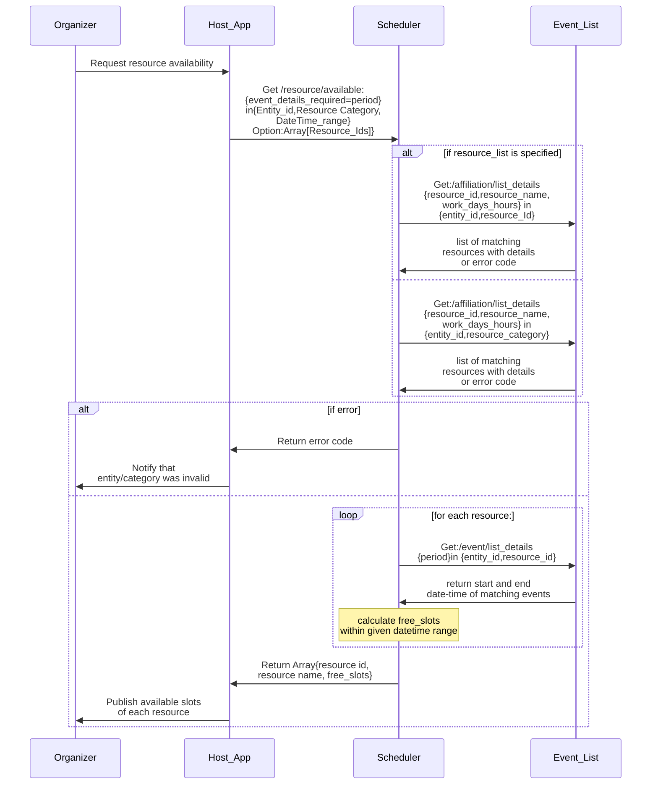

#### 3. Allocating resource\[s] to an Event

An Organizer may allocate specific resources into a predefined event by request to the Scheduler through the host application with specific resource\_ids and event\_id.  If the event period falls outside of the work-days-hours of the resource in the associated host entity, it will return an error code. In the normal course, the Scheduler returns allocates each resource into the given entity and returns success. The Host application will publish the status to the Organizer accordingly.

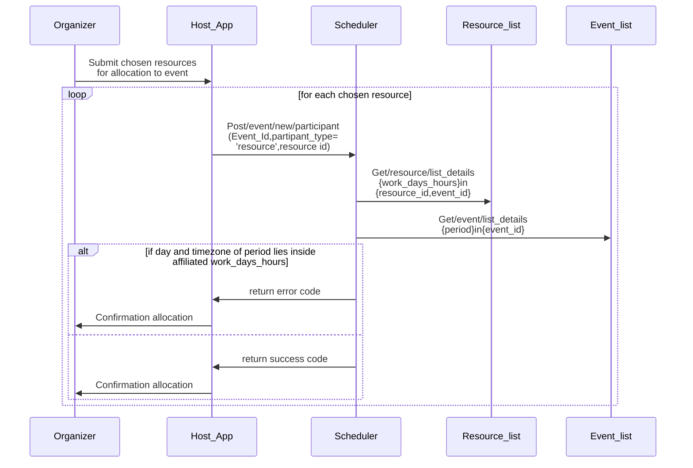

#### 4. Finding events of a given category and resource in a given date-time range&#x20;

In some scenarios, one may search for events of a specific category involving a specific resource of a specific host entity (e.g. consultation with a specific doctor in a particular hospital) that are open for subscription. The organizer can feed through a host app, a date range, event category, entity ID, and resource\_id seeking matching events with status=open. The Scheduler seeks its Event\_List for the details of matching events which are open for subscription. The Event List returns a list of matching events with details or any other error condition. This is returned to the host app which will publish results to the Organizer.

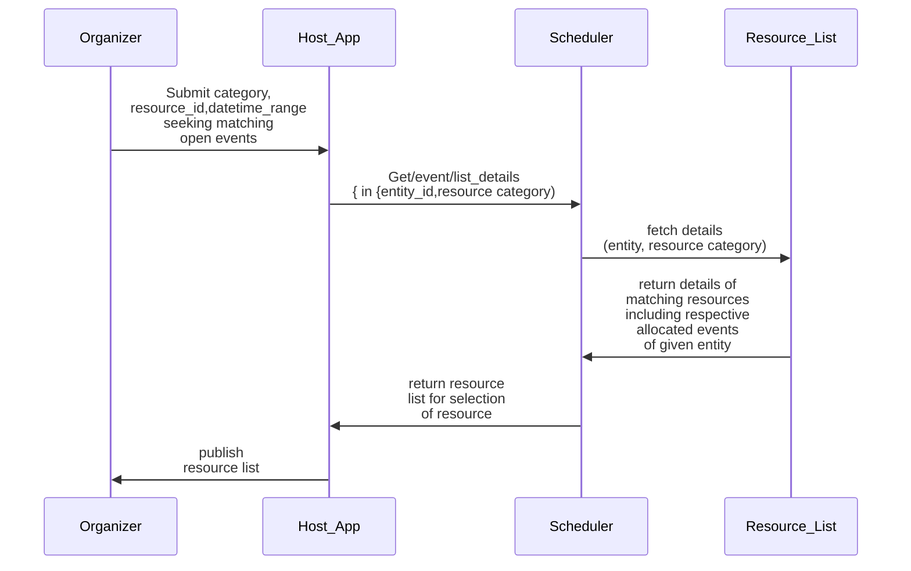

#### 5.  Appointment Scheduling for resource or subscriber to a specific event

An organizer may enroll a subscriber or resource to a specific event through a host app by giving selecting the participant and event id. The host app will request the scheduler to enroll the candidate into the given event by giving the participant type (resource or subscriber), id of the participant, and event id. Based on the participant type, the scheduler first checks its subscriber\_list or Resrouce list if participant\_id exists and returns an error code if it is not found. The host app may then prompt the organizer to first register the Subscriber/Resource details.  In the normal course, the Scheduler will add a registered participant as subscriber or resource to the event list and confirm successful enrolment to the user through the host app.

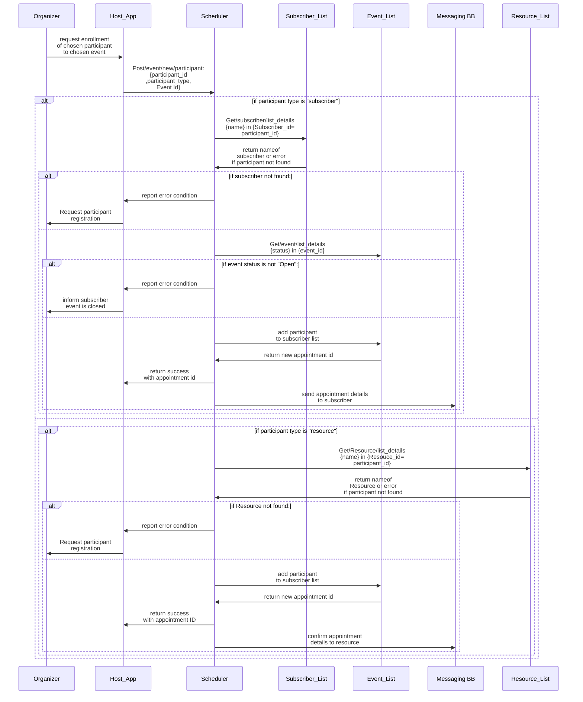

**6. Cancellation of appointment:**&#x20;

An organizer may cancel an existing appointment of a resource or a subscriber for an event using the Host App. The user may submit the participant id or participant type (subscriber/resource) and the event id to the Scheduler through the host app, requesting for cancellation of respective enrollment for the event. If the Scheduler finds the given event id and subscriber/resource id in the event\_list it will delete the enrolment entry of the given resource in the given event, else it will return an appropriate error message. The Host-app confirms success or error condition to the user. The Scheduler also emits a notification through Messaging Building Block to inform the canceled participant only (in different implementations one can also inform all participants). It should be noted that the deletion of the enrolment of a subscriber does not remove subscriber/resource details stored in the subscriber/resource list, but it removes only the allocation to the specific event.&#x20;

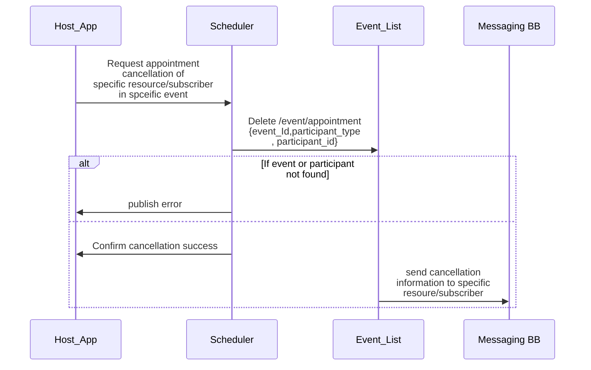

#### 7. Registering new Alert Message Template

Several predefined templates of alert messages can be stored in a Message List so that they can be reused in different alerts and events (for example appointment reminders, triggers to devices and s/w applications, etc.  Using a host app an organizer may submit a new message and request the Scheduler to register the message. The Scheduler tries to store a new entry in its message list and returns a success or error code in response.

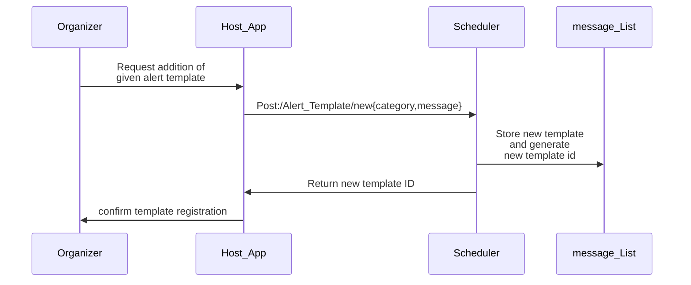

#### 8.  Scheduling Alerts for a given event

An organizer may schedule different alert messages to be sent to subscribers and resources before, during, and after a prescheduled event. It is assumed here that the alert messages are borrowed from a list of messaging templates within the Scheduler that have been pre-registered and affiliated with a specific entity. The Organizer may use a host app to request the Scheduler to create a new alert schedule by choosing the alert message template, date-time of when the alert is to be sent, what channel the messages need to be sent through (SMS/Email/URL/etc.) and type of targets to receive the message (subscriber/resource/both). If the Scheduler finds all inputs valid it will store the details against a unique Alert Schedule id in the Alert\_schedile\_list and returns success status and the unique id, otherwise, it will return an appropriate error code. This workflow assumes that the message templates created by the organizer of one entity should not be accessible to organizers of another entity. Also, it is assumed that all participants of a given type (resource/subscriber/both) will receive the alert. If a specific implementation needs to define individual participants who should receive a specific alert, it will require further refining of the steps laid out here and is out of scope for current workflow.

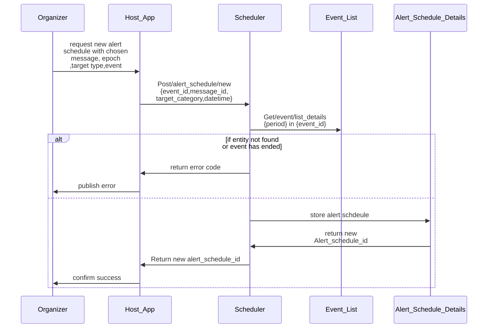

#### 9. Tracking and Alerting as per schedule

Scheduler's internal tracker keeps fetching (with a predefined interval) a list of all alerts for which the scheduled date time has arrived (within the interval). For each alert that is ready to go, it will send the alert message to all participants of the respective event, based on the given target type (resource/ subscriber/ both). The alert message will be sent using the preferred channel (sms/URL/mail) registered in the resources /subscribers list. It should be noted that the Scheduler does not wait for confirmation of the delivery of the message. In the current context, a recipient of an alert may asynchronously send back a delivery acknowledgement to the log update (see log update workflow) of the Scheduler.&#x20;

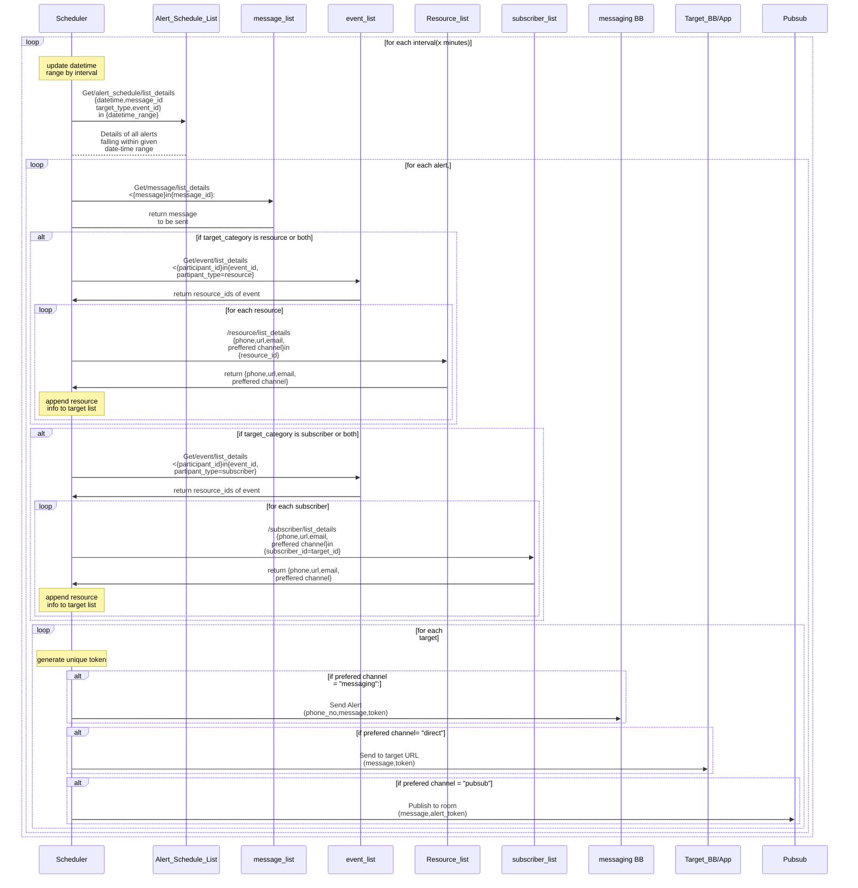

#### 9. Cancellation of scheduled event 

Organizer can request the cancellation of a prescheduled event through host app by supplying the event id. The Scheduler first removes dependent alert\_schedules and obtains the list of resources and subscribers empaneled in the event. It then deletes the event from the event list and returns success to the host app for confirmation to the organizer. Optionally it can send out event cancellation message through preferred channels to all subscribers and resources of the event, before deleting the event from the event list.

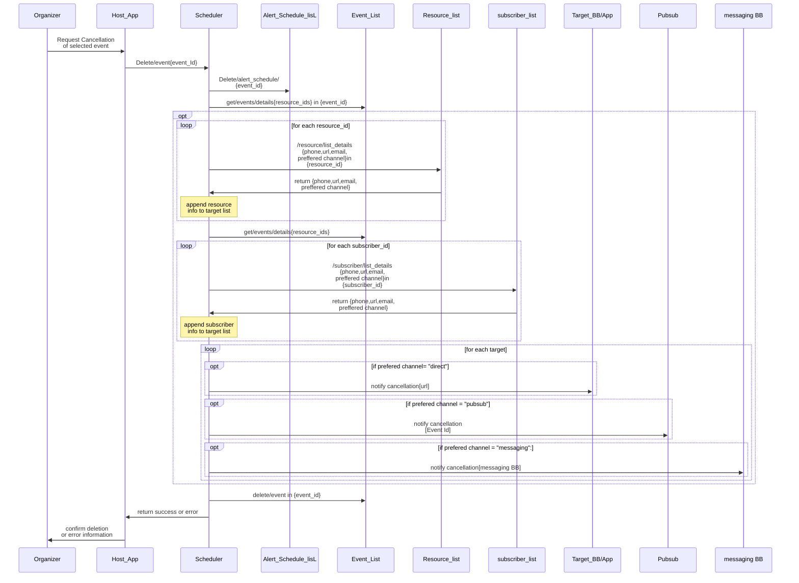

#### 10. Log reporting

In this workflow, a simple case of extracting chosen type of log in a given time range is described. The Organizer requests the scheduler through a host app to report logs of a chosen category within a chosen date range. The scheduler fetches a list of matching logs found from its Log\_List, or null if nothing is found. The scheduler publishes the logs or null to the user through the host app. This function can be extended in different implementations to generate more complex types of reports based on information in the log.&#x20;

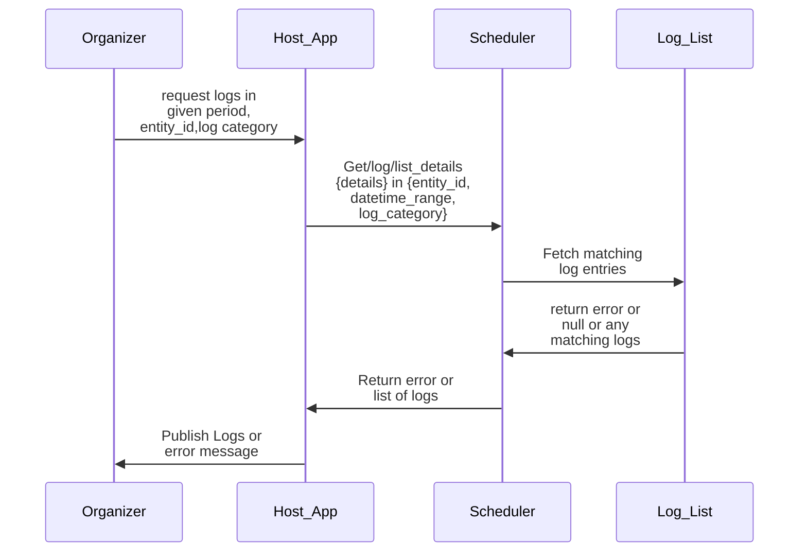

**11.Registering a new entity**

An new entity can use the scheduler MUST be registered by the administrator of the Scheduler Building Block. The Administrator requests entity registration in the scheduler through Scheduler's administrative front-end user interface by supplying relevant entity details. The Scheduler after verifying the requestor's credentials will store the entity information against a new entity id it generates. In case it finds that the entity details match any of earlier registered entities it returns an error code and avoids duplication. In the normal course, the entity id is returned to the Administrator along with prompt to register an Organizer resource for that entity, to use the Scheduler further.

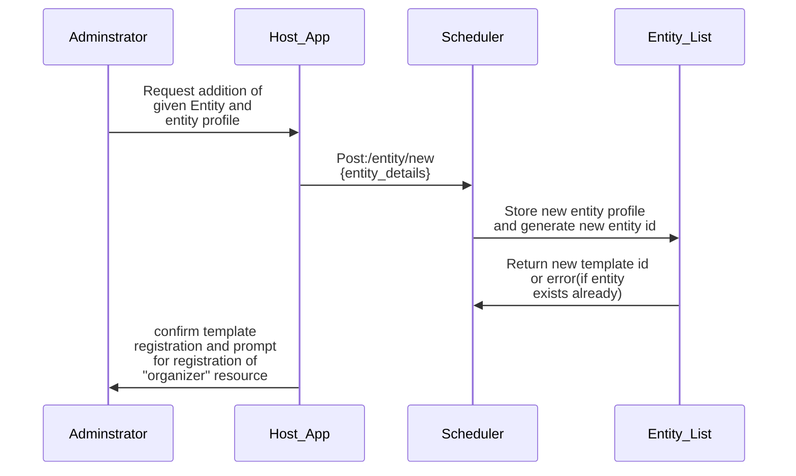

**12. Registering a new resource**

An organizer MUST register into the scheduler various categories of resources {people, equipment, vehicles, facility, etc.) into a specific entity before the resource can be used in different events. An organizer is also a resource of an entity but can be registered only by Administrator of the Building Block. An organizer can register resources of other categories only into his/her affiliated entity only. The registration process begins with the submission of resource details with the request to scheduler for registration of resource. The Scheduler internally stores details of the resource into a resource\_list and generates a new resource id.&#x20;

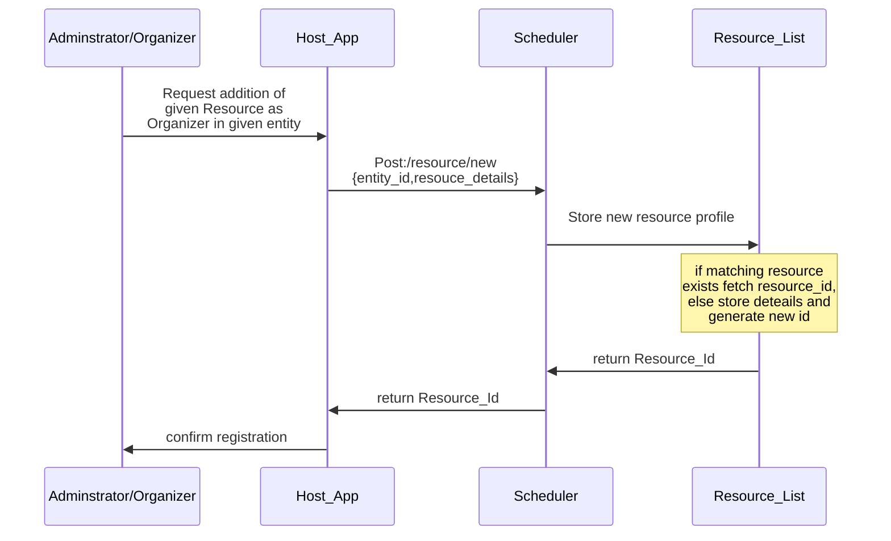

**13. Affiliating a resource to an entity**

A registered resource MUST be affiliated with at least one entity. A resource MAY be affiliated to different entities only in non-overlapping day-time zones(e.g. doctor may give consultation in multiple hospitals).  An organizer can be affiliated only by an administrator. All other categories of resources can be affiliated by an Organizer. The affiliation request may be submitted through the host-App to the scheduler along with affiliation details (resource\_id,entity\_id, affiliated days and time zones in that entity, etc.). The scheduler will add a new affiliation of that resource to the new entity in the Affiliation List and generate a new affiliation id. The Scheduler flags an error if it finds a duplicate entry.

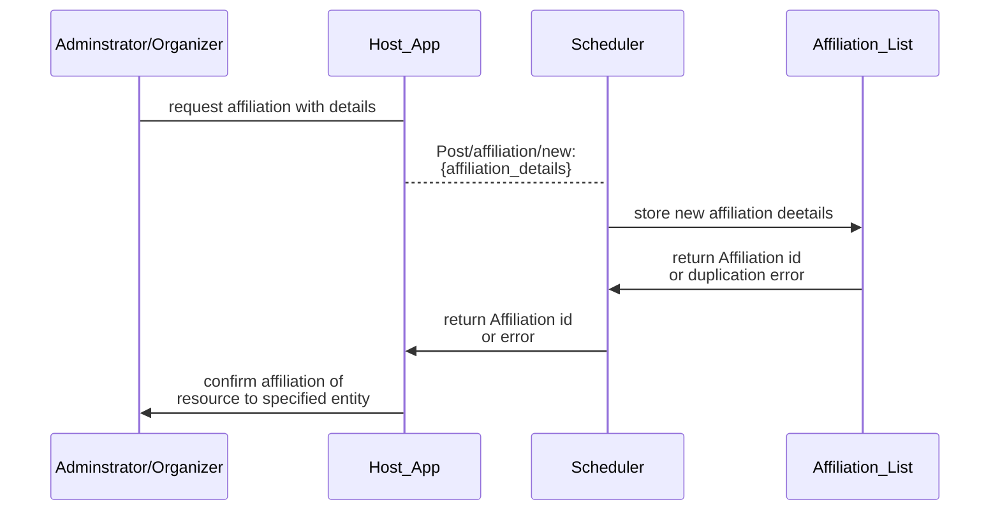

**14. Registering a new Subscriber**

&#x20;An organizer can register into the scheduler a new subscriber's details into a specific entity. A subscriber must be registered into the scheduler before they are allowed to book appointments for various events. This example considers that Organizer can register resources of other categories only into his/her affiliated entity only. The organizer submits subscriber details through Host\_App to Scheduler requesting registration.  The Scheduler internally stores details of the subscriber into its subscriber\_list and generates a new resource id. The Scheduler returns the new subscriber id or a duplication error if it finds the subscriber profile is already existing. The Host app confirms registration or duplication error to the Organizer.

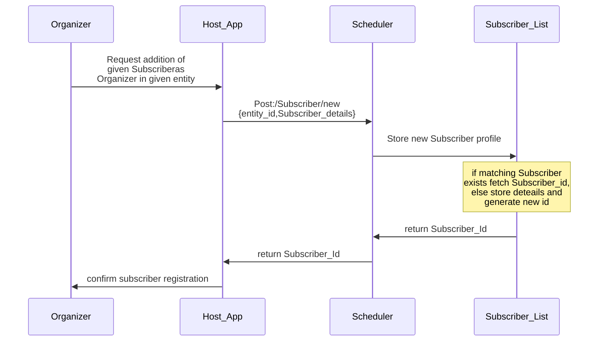
