# 9 Workflows

## Use case definitions:

Use cases of Post-Partum care and Unconditional Social Benefit transfer programs were used in current scope to derive key digital functionalities. The current assumptions and definition of these use cases are given below:

### UseCase-1 Doctor Consultation Appointment scheduling: Post-Partum Care Program 

| ID                                                            | PPCP\_Scheduler\_UC\_01                                                                                                                                                                                                                                                                                                                                                                                                                                                                                                                                                                                                                                                                                                                                                                                                                                                                                                                                                                                                                                                                                                                                                                                                                                                                                                                                                                                                                                                                                                                                                                                                                                                                                                                                                                                                                                                                                                                                                                                                                                                                                                                                                                                                                                                                                                                                                                                                                                                                                                                                                                                                                                                                                                                                                                                                                                                                                                                                                                                                                                                                                                                                                                                                                                                                                                                                                                                                                                                                                                                                                                                                                                                                       |
| ------------------------------------------------------------- | --------------------------------------------------------------------------------------------------------------------------------------------------------------------------------------------------------------------------------------------------------------------------------------------------------------------------------------------------------------------------------------------------------------------------------------------------------------------------------------------------------------------------------------------------------------------------------------------------------------------------------------------------------------------------------------------------------------------------------------------------------------------------------------------------------------------------------------------------------------------------------------------------------------------------------------------------------------------------------------------------------------------------------------------------------------------------------------------------------------------------------------------------------------------------------------------------------------------------------------------------------------------------------------------------------------------------------------------------------------------------------------------------------------------------------------------------------------------------------------------------------------------------------------------------------------------------------------------------------------------------------------------------------------------------------------------------------------------------------------------------------------------------------------------------------------------------------------------------------------------------------------------------------------------------------------------------------------------------------------------------------------------------------------------------------------------------------------------------------------------------------------------------------------------------------------------------------------------------------------------------------------------------------------------------------------------------------------------------------------------------------------------------------------------------------------------------------------------------------------------------------------------------------------------------------------------------------------------------------------------------------------------------------------------------------------------------------------------------------------------------------------------------------------------------------------------------------------------------------------------------------------------------------------------------------------------------------------------------------------------------------------------------------------------------------------------------------------------------------------------------------------------------------------------------------------------------------------------------------------------------------------------------------------------------------------------------------------------------------------------------------------------------------------------------------------------------------------------------------------------------------------------------------------------------------------------------------------------------------------------------------------------------------------------------------------------- |
| **Name**                                                      | Consultation Appointment (Health worker assisted): Post-Partum Care Program                                                                                                                                                                                                                                                                                                                                                                                                                                                                                                                                                                                                                                                                                                                                                                                                                                                                                                                                                                                                                                                                                                                                                                                                                                                                                                                                                                                                                                                                                                                                                                                                                                                                                                                                                                                                                                                                                                                                                                                                                                                                                                                                                                                                                                                                                                                                                                                                                                                                                                                                                                                                                                                                                                                                                                                                                                                                                                                                                                                                                                                                                                                                                                                                                                                                                                                                                                                                                                                                                                                                                                                                                   |
| **User Journey**                                              | [https://github.com/GovStackWorkingGroup/BuildingBlockAPI/projects/1](https://github.com/GovStackWorkingGroup/BuildingBlockAPI/projects/1)                                                                                                                                                                                                                                                                                                                                                                                                                                                                                                                                                                                                                                                                                                                                                                                                                                                                                                                                                                                                                                                                                                                                                                                                                                                                                                                                                                                                                                                                                                                                                                                                                                                                                                                                                                                                                                                                                                                                                                                                                                                                                                                                                                                                                                                                                                                                                                                                                                                                                                                                                                                                                                                                                                                                                                                                                                                                                                                                                                                                                                                                                                                                                                                                                                                                                                                                                                                                                                                                                                                                                    |
| 
<strong>Description</strong>

 <strong></strong> 
 | In this use case an organizer (health worker) schedules a consultation event for a subscriber (mother), with a Resource (doctor) of a service provider entity (Clinic) enrolled in the PPCPMC Program. To do this the organizer submits a request to the system for an appointment slot indicating preferred doctor, date range, time zone in favor of the patient’s convenience. The system indicates free slots of the doctor matching the request along with address and terms of service. The health worker selects a specific slot confirmed by the patient and requests the system to book selected slot. The Health worker collects any relevant service charges for the selected appointment from the patient through the PPCP system. The system confirms back to health worker after posting the consultation event on the doctor’s worklist and sends a confirmation message (unique appointment token, date, time, location, consultant details, website links, etc.). The scheduler further tracks the appointment and sends reminder to the patient on the day of appointment. During consultation the doctor obtains the appointment token from the patient and feeds into the system, which is routed to the scheduler to mark attendance in the specific session. If no attendance is received within a predefined tolerance period after session, the scheduler marks “no-show” status for that session. The health worker may also cancel one or more specific sessions  in a prescheduled event track. The Health worker can reschedule an event track by first booking another session and then cancelling the old session. In case of any such changes, the scheduler automatically sends appropriate notifications to all resources (health worker/doctor) and consumers(Patient)                                                                                                                                                                                                                                                                                                                                                                                                                                                                                                                                                                                                                                                                                                                                                                                                                                                                                                                                                                                                                                                                                                                                                                                                                                                                                                                                                                                                                                                                                                                                                                                                                                                                                                                                                                                                                                                                                      |
| **Trigger**                                                   | 
PPCP App sends request to scheduler BB for a create/cancel a consultation event.

PPCP App sends request to scheduler BB to report list of events with status

PPCP App sends request to Scheduler BB to update status of specific event
                                                                                                                                                                                                                                                                                                                                                                                                                                                                                                                                                                                                                                                                                                                                                                                                                                                                                                                                                                                                                                                                                                                                                                                                                                                                                                                                                                                                                                                                                                                                                                                                                                                                                                                                                                                                                                                                                                                                                                                                                                                                                                                                                                                                                                                                                                                                                                                                                                                                                                                                                                                                                                                                                                                                                                                                                                                                                                                                                                                                                                                                                                                                                                                                                                                                                                                                                                                                                                     |
| 
<strong>Preconditions</strong>  
                 | 
1.      Entities that provide consultation services are registered under the PPCP program

2.      Subscriber(Patient), Health worker and consultant(Doctor) are already registered and affiliated to provider entities of PPCP program

3.       All BBs are already registered with the infomed BB Service Directory

4.      The Service provider entity has already provisioned the “consultation” service “Event” into the scheduler with multiple episodes and session slots with allocation of resources (Doctors), so that the subscriber (patient) can chose an appropriate session. (as per workflow indicated below)

5.      Health worker and Consultant are logged into GovStack PPCP application to do their respective tasks

6.      Subscriber and health worker know which entity, consultant and candidate days are preferred for booking a consultation session

7.      Subscriber is enabled with a payment modality as required by the PPCP program to collect charges if any, for the consultation

8.      PPCP registry has record of latest mobile phone number or email Id of subscriber, Health worker and Consultant
                                                                                                                                                                                                                                                                                                                                                                                                                                                                                                                                                                                                                                                                                                                                                                                                                                                                                                                                                                                                                                                                                                                                                                                                                                                                                                                                                                                                                                                                                                                                                                                                                                                                                                                                                                                                                                                                                                                                                                                                                                                                                                                                                                                                                                                                                                                                                                                                                                                                                                 |
| **Data inputs**                                               | 
1.      Query parameters to find free slots

2.      Query parameters to generate event status reports

3.      Event Schedule and details needed for booking/cancellation

4.      Event status confirmation for specific event (in this case attendance)
                                                                                                                                                                                                                                                                                                                                                                                                                                                                                                                                                                                                                                                                                                                                                                                                                                                                                                                                                                                                                                                                                                                                                                                                                                                                                                                                                                                                                                                                                                                                                                                                                                                                                                                                                                                                                                                                                                                                                                                                                                                                                                                                                                                                                                                                                                                                                                                                                                                                                                                                                                                                                                                                                                                                                                                                                                                                                                                                                                                                                                                                                                                                                                                                                                                                                                                                                                                                              |
| 
<strong>Actors</strong>  
                        | 
1.      Subscriber (mother)

2.      Service provider (Doctor)

3.      Organizer (Health Worker)
                                                                                                                                                                                                                                                                                                                                                                                                                                                                                                                                                                                                                                                                                                                                                                                                                                                                                                                                                                                                                                                                                                                                                                                                                                                                                                                                                                                                                                                                                                                                                                                                                                                                                                                                                                                                                                                                                                                                                                                                                                                                                                                                                                                                                                                                                                                                                                                                                                                                                                                                                                                                                                                                                                                                                                                                                                                                                                                                                                                                                                                                                                                                                                                                                                                                                                                                                                                                                                                                                                                                                                            |
| **Normal Course**                                             | 
1.      Appointment booking:

a.      Organizer(Health worker) captures subscriber’s (Patient) preferences (such as doctor, dates, time-zones, entities, etc.) in PPCP App and submits appointment request for a consultation session

b.      PPCP App routes request to Scheduler to find free consultation session slots that match given preferences

c.      Scheduler BB returns free slots matching stated preferences, along with information if any (charges, terms, instructions, etc.)

d.      Optionally Health worker may collect charges, if any, based on the slot chosen by customer, through PPCP App

e.      Health worker confirms slot chosen by subscriber (patient) to PPCP_App

f.       PPCP App sends booking requests for specific sessions to Scheduler BB, along with required patient contact information

g.      Scheduler BB posts appointment event details on doctor’s worklist database

h.      Scheduler BB replies with booking confirmation reference ID to PPCP App to be used later for doing status check

i.       PPCP_App publishes booking confirmation to health worker (appointment token may be hidden here)

2.      Appointment Cancellation:

a.      Organizer (Health worker) submits appointment ID and request for cancellation of booked session through PPCP_app to Scheduler[planner]

b.      Scheduler [planner] internally sends request to its [worklist] to delete the consumer from session at given appointment ID

c.      Scheduler [worklist] deletes customer from specific session and checks if there are no more consumers sets session status as “available” and confirms cancellation back to Scheduler [planner] module

d.      Scheduler BB returns publishes cancellation information onto PPCP_App and sends out notifications to associated resources and consumers through messaging BB

e.      Optionally the Scheduler planner polls notification delivery status from the Messaging BB and updates its internal log

 

3.      Appointment tracking and alerting: Scheduler BB tracker loops polling schedules for various events, episodes and sessions to process alerts at right time. When the time for a scheduled alert arrives, the tracker sends notification to associated target people/machines. Based on Alert mode, it could notify through messaging BB, or directly to a given target’s URL or through its Pub-sub room. The alert message is cast with an appropriate payload containing details and instructions necessary for its targets. The alerts may be used to

a.      send appointment reminders to subscriber(patient) before the appointment

b.      to send instructions to patients

c.      to send notification of cancellation or alteration of original appointment if any

d.      To inform the consultant (Doctor) about the appointment

3. Event Status update and reporting:  During consultation, the doctor enters into PPCP App the appointment token collected from the patient during consultation to mark attendance. The PPCP App updates session status by getting to know the status through alternate mechanisms

a.      Status update from PPCP_App through a Rest-API exposed by the scheduler when doctor enters the appointment token

b.      Through its information mediator Pub-sub room of PPCP_App where the scheduler BB is a subscriber to “status updates”

PPCP_App responds to an explicit status query from the Scheduler using the booking confirmation reference ID issued earlier

 
 |
| **Alternative Course**                                        | In an alternative scenario, patients may themselves login to the PPCP\_App application and book appointments without support of Health worker. This is a subset of the workflow mentioned above.                                                                                                                                                                                                                                                                                                                                                                                                                                                                                                                                                                                                                                                                                                                                                                                                                                                                                                                                                                                                                                                                                                                                                                                                                                                                                                                                                                                                                                                                                                                                                                                                                                                                                                                                                                                                                                                                                                                                                                                                                                                                                                                                                                                                                                                                                                                                                                                                                                                                                                                                                                                                                                                                                                                                                                                                                                                                                                                                                                                                                                                                                                                                                                                                                                                                                                                                                                                                                                                                                              |
| **Data output**                                               | 
1.                List of available free slots

2.                Report of Session status and Alert status based on query parameters

3.                Event Booking Confirmation Messages

4.                Event related alert Messages
                                                                                                                                                                                                                                                                                                                                                                                                                                                                                                                                                                                                                                                                                                                                                                                                                                                                                                                                                                                                                                                                                                                                                                                                                                                                                                                                                                                                                                                                                                                                                                                                                                                                                                                                                                                                                                                                                                                                                                                                                                                                                                                                                                                                                                                                                                                                                                                                                                                                                                                                                                                                                                                                                                                                                                                                                                                                                                                                                                                                                                                                                                                                                                                                                                                                                                                                                                                                                            |
| **Post-Conditions**                                           | 
Appointment booking: Specific session of event plan is updated with either completed or no-show status

Event Tracking: Alert notifications have reached target people/machines as per schedule

Status updating: Relevant sessions status updated suitably to reflect “pending”/”triggered”/ “completed”/“failed”/ “no-show”

Reporting: Relevant datasets are returned as JSON formatted string
                                                                                                                                                                                                                                                                                                                                                                                                                                                                                                                                                                                                                                                                                                                                                                                                                                                                                                                                                                                                                                                                                                                                                                                                                                                                                                                                                                                                                                                                                                                                                                                                                                                                                                                                                                                                                                                                                                                                                                                                                                                                                                                                                                                                                                                                                                                                                                                                                                                                                                                                                                                                                                                                                                                                                                                                                                                                                                                                                                                                                                                                                                                                                                                                                                                                       |
| **Exceptions**                                                | 
PPCP_App prompts Organizer(Health worker) to request new appointment if confirmation is not received from Scheduler within a predefined timeout  period

Scheduler will mark a session as “no show” if no status update is received within a tolerance period after triggering session alerts
                                                                                                                                                                                                                                                                                                                                                                                                                                                                                                                                                                                                                                                                                                                                                                                                                                                                                                                                                                                                                                                                                                                                                                                                                                                                                                                                                                                                                                                                                                                                                                                                                                                                                                                                                                                                                                                                                                                                                                                                                                                                                                                                                                                                                                                                                                                                                                                                                                                                                                                                                                                                                                                                                                                                                                                                                                                                                                                                                                                                                                                                                                                                                                                                                                                                                                                                                                                     |
| **Related BBs**                                               | Service ordering, Registration, workflow, Information mediator, Messaging, PPCP App                                                                                                                                                                                                                                                                                                                                                                                                                                                                                                                                                                                                                                                                                                                                                                                                                                                                                                                                                                                                                                                                                                                                                                                                                                                                                                                                                                                                                                                                                                                                                                                                                                                                                                                                                                                                                                                                                                                                                                                                                                                                                                                                                                                                                                                                                                                                                                                                                                                                                                                                                                                                                                                                                                                                                                                                                                                                                                                                                                                                                                                                                                                                                                                                                                                                                                                                                                                                                                                                                                                                                                                                           |
| **Remarks**                                                   | This use case model can be used for other types of consultations such as legal/financial/education/career/etc. between corresponding subscribers (plaintiff, investor, student, professional, etc.) and respective consultants (lawyer, auditor, teacher, counsellor, etc.), where an assigned assistant (admin, health worker, admin, caretaker, Kin) of the subscriber may organize their appointments                                                                                                                                                                                                                                                                                                                                                                                                                                                                                                                                                                                                                                                                                                                                                                                                                                                                                                                                                                                                                                                                                                                                                                                                                                                                                                                                                                                                                                                                                                                                                                                                                                                                                                                                                                                                                                                                                                                                                                                                                                                                                                                                                                                                                                                                                                                                                                                                                                                                                                                                                                                                                                                                                                                                                                                                                                                                                                                                                                                                                                                                                                                                                                                                                                                                                      |

### Workflows

#### Consultation service scheduling

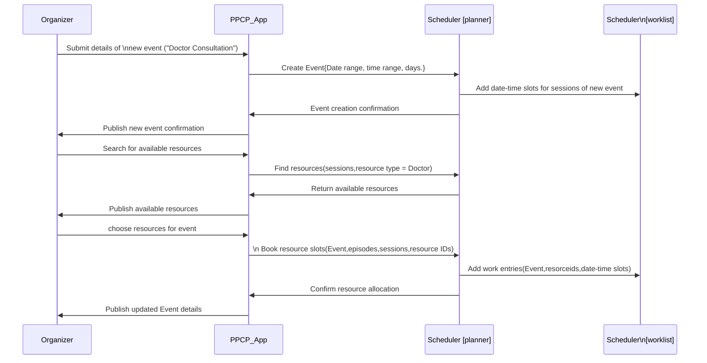
```mermaid
sequenceDiagram

Organizer->>PPCP_App: Submit details of \nnew event ("Doctor Consultation")
PPCP_App->>Scheduler [planner]:Create Event{Date range, time range, days.}
Scheduler [planner]->>Scheduler\n[worklist]: Add date-time slots for sessions of new event
Scheduler [planner]->>PPCP_App: Event creation confirmation
PPCP_App->>Organizer: Publish new event confirmation
Organizer->>PPCP_App: Search for available resources
PPCP_App->>Scheduler [planner]: Find resources(sessions,resource type = Doctor)
Scheduler [planner]->>PPCP_App: Return available resources
PPCP_App->>Organizer: Publish available resources
Organizer->>PPCP_App: choose resources for event
PPCP_App->>Scheduler [planner]:\n Book resource slots(Event,episodes,sessions,resource IDs)
Scheduler [planner]->>Scheduler\n[worklist]: Add work entries(Event,resorceids,date-time slots)
Scheduler [planner]->>PPCP_App: Confirm resource allocation
PPCP_App->>Organizer: Publish updated Event details
```

#### Booking appointment in a specific session slot

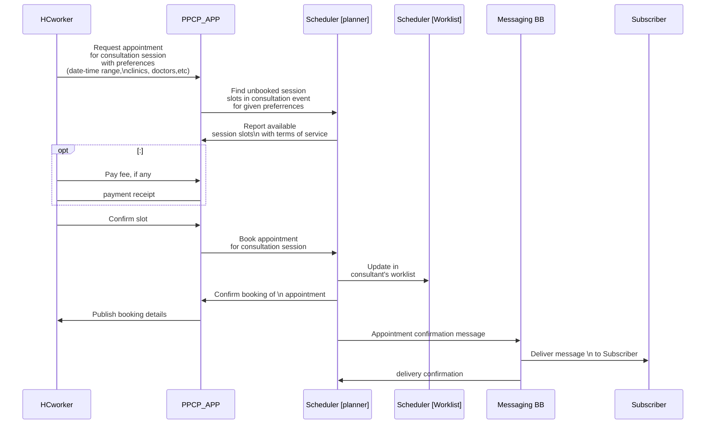
```mermaid
sequenceDiagram

HCworker->>PPCP_APP: Request appointment<br />for consultation session<br /> with preferences<br />(date-time range,\nclinics, doctors,etc)
PPCP_APP->>Scheduler [planner]: Find unbooked session<br />slots in consultation event<br />for given preferrences
Scheduler [planner]->>PPCP_APP: Report available<br />session slots\n with terms of service
opt: 
    HCworker ->>PPCP_APP:Pay fee, if any
    PPCP_APP->HCworker:payment receipt 
end
HCworker->>PPCP_APP:Confirm slot 
PPCP_APP->>Scheduler [planner]: Book appointment<br />for consultation session 
Scheduler [planner]->>Scheduler [Worklist]: Update in<br />consultant's worklist
Scheduler [planner]->>PPCP_APP:Confirm booking of \n appointment
PPCP_APP->>HCworker:Publish booking details 
Scheduler [planner]->>Messaging BB: Appointment confirmation message
Messaging BB->>Subscriber: Deliver message \n to Subscriber
Messaging BB->>Scheduler [planner]: delivery confirmation
```

#### Cancellation of booked appointment

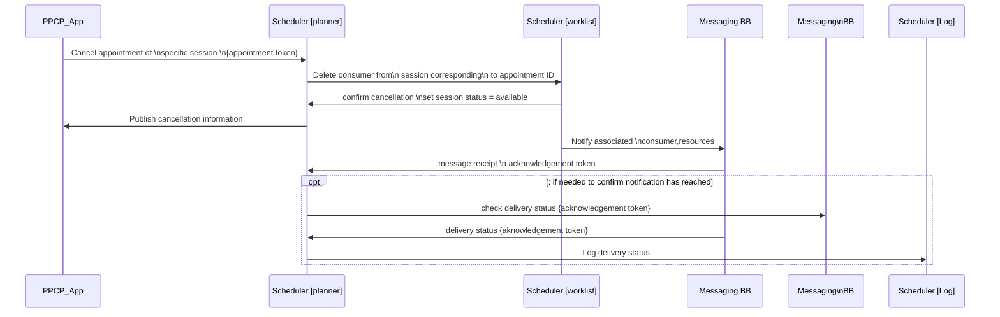
```mermaid
sequenceDiagram

PPCP_App->>Scheduler [planner]: Cancel appointment of \nspecific session \n{appointment token}
Scheduler [planner]->>Scheduler [worklist]: Delete consumer from\n session corresponding\n to appointment ID
Scheduler [worklist]->>Scheduler [planner]: confirm cancellation,\nset session status = available
Scheduler [planner]->>PPCP_App:Publish cancellation information
Scheduler [worklist]->>Messaging BB: Notify associated \nconsumer,resources
Messaging BB->>Scheduler [planner]: message receipt \n acknowledgement token
opt: if needed to confirm notification has reached 
  Scheduler [planner]->>Messaging\nBB: check delivery status {acknowledgement token}
  Messaging BB->>Scheduler [planner]:delivery status {aknowledgement token}
  Scheduler [planner]->>Scheduler [Log]:Log delivery status
end
```

#### Appointment  tracking and alerting as per schedule

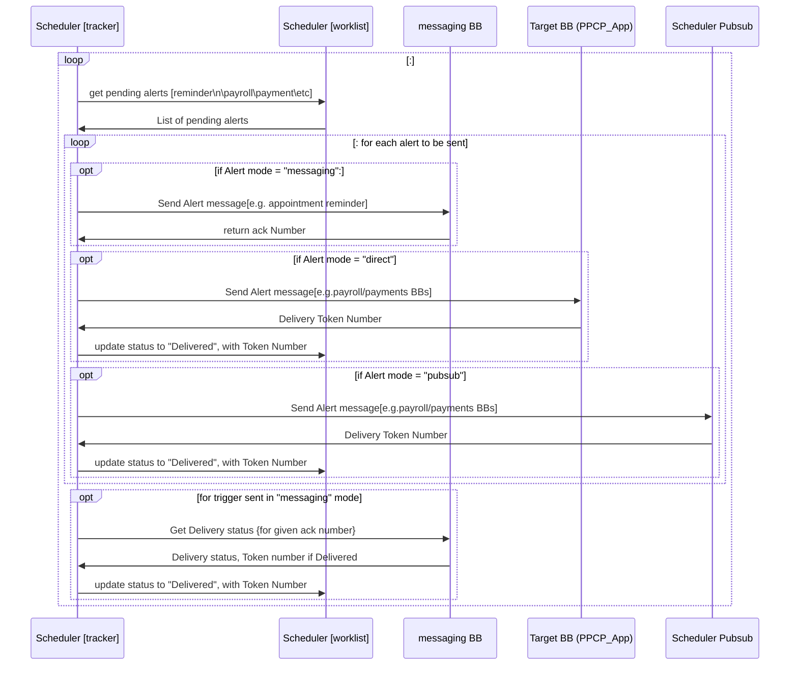
```mermaid
sequenceDiagram

loop:
    Scheduler [tracker]->>Scheduler [worklist]:get pending alerts [reminder\n\payroll\payment\etc] 
    Scheduler [worklist]->>Scheduler [tracker]: List of pending alerts 
    loop: for each alert to be sent
        opt if Alert mode = "messaging":
            Scheduler [tracker]->>messaging BB: Send Alert message[e.g. appointment reminder]
            messaging BB->>Scheduler [tracker]: return ack Number
        end
        opt if Alert mode = "direct"
            Scheduler [tracker]->>Target BB (PPCP_App): Send Alert message[e.g.payroll/payments BBs] 
            Target BB (PPCP_App)->>Scheduler [tracker]: Delivery Token Number
            Scheduler [tracker]->>Scheduler [worklist]: update status to "Delivered", with Token Number
        end
        opt if Alert mode = "pubsub"
            Scheduler [tracker]->>Scheduler Pubsub: Send Alert message[e.g.payroll/payments BBs] 
            Scheduler Pubsub->>Scheduler [tracker]: Delivery Token Number
            Scheduler [tracker]->>Scheduler [worklist]: update status to "Delivered", with Token Number
        end
    end
  Opt for trigger sent in "messaging" mode
    Scheduler [tracker]->>messaging BB: Get Delivery status {for given ack number}
    messaging BB->>Scheduler [tracker]: Delivery status, Token number if Delivered
    Scheduler [tracker]->>Scheduler [worklist]: update status to "Delivered", with Token Number
  end
end
```

#### Updating status of a triggered session

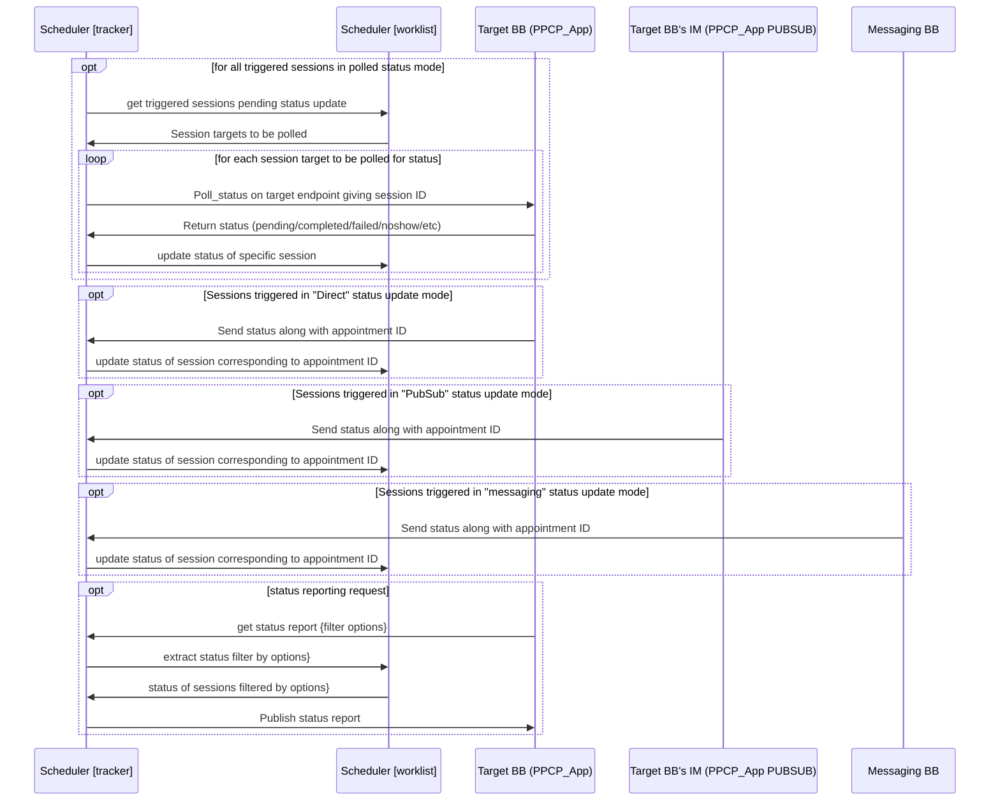
```mermaid
sequenceDiagram

opt for all triggered sessions in polled status mode 
Scheduler [tracker]->>Scheduler [worklist]:get triggered sessions pending status update
Scheduler [worklist]->>Scheduler [tracker]: Session targets to be polled  
    loop for each session target to be polled for status
        Scheduler [tracker]->>Target BB (PPCP_App): Poll_status on target endpoint giving session ID
        Target BB (PPCP_App)->>Scheduler [tracker]: Return status (pending/completed/failed/noshow/etc)
        Scheduler [tracker]->>Scheduler [worklist]: update status of specific session 
    end
end
opt Sessions triggered in "Direct" status update mode
    Target BB (PPCP_App)->>Scheduler [tracker]: Send status along with appointment ID 
    Scheduler [tracker]->>Scheduler [worklist]: update status of session corresponding to appointment ID
end

opt Sessions triggered in "PubSub" status update mode
    Target BB's IM (PPCP_App PUBSUB)->>Scheduler [tracker]: Send status along with appointment ID 
    Scheduler [tracker]->>Scheduler [worklist]: update status of session corresponding to appointment ID
end
opt Sessions triggered in "messaging" status update mode
    Messaging BB->>Scheduler [tracker]: Send status along with appointment ID 
    Scheduler [tracker]->>Scheduler [worklist]: update status of session corresponding to appointment ID
end
opt status reporting request
    Target BB (PPCP_App)->>Scheduler [tracker]:get status report {filter options}
    Scheduler [tracker]->>Scheduler [worklist]:extract status filter by options}
     Scheduler [worklist]->>Scheduler [tracker]:status of sessions filtered by options}
     Scheduler [tracker]->>Target BB (PPCP_App):Publish status report 
end
```

### UseCase-2 Periodic Payroll and Payments Event scheduling : Post-Partum Care & Unconditional Social Benefit transfer programs

&#x20;****&#x20;

| **Name**                                                      | Payroll and payments scheduling: Post Partum Care Program (PPCP) and Unconditional Social Benefit Transfer                                                                                                                                                                                                                                                                                                                                                                                                                                                                                                                                                                                                                                                                                                                                                                                                                                                                                                                                                                                                                                                                                                                                                                                                                                                                                                                                                                                                                                                                                                                                                                                                                                                                                                                                                                                                                                                                                                                                                                                                                                                                                                                                                                                                                                                                                                                                                                                                                                                                                                                                                                                                                                                                                                                                                                                                                                                                                                                                                                                                                                                                                                                                                                                                                                                                                                                                                                              |
| ------------------------------------------------------------- | --------------------------------------------------------------------------------------------------------------------------------------------------------------------------------------------------------------------------------------------------------------------------------------------------------------------------------------------------------------------------------------------------------------------------------------------------------------------------------------------------------------------------------------------------------------------------------------------------------------------------------------------------------------------------------------------------------------------------------------------------------------------------------------------------------------------------------------------------------------------------------------------------------------------------------------------------------------------------------------------------------------------------------------------------------------------------------------------------------------------------------------------------------------------------------------------------------------------------------------------------------------------------------------------------------------------------------------------------------------------------------------------------------------------------------------------------------------------------------------------------------------------------------------------------------------------------------------------------------------------------------------------------------------------------------------------------------------------------------------------------------------------------------------------------------------------------------------------------------------------------------------------------------------------------------------------------------------------------------------------------------------------------------------------------------------------------------------------------------------------------------------------------------------------------------------------------------------------------------------------------------------------------------------------------------------------------------------------------------------------------------------------------------------------------------------------------------------------------------------------------------------------------------------------------------------------------------------------------------------------------------------------------------------------------------------------------------------------------------------------------------------------------------------------------------------------------------------------------------------------------------------------------------------------------------------------------------------------------------------------------------------------------------------------------------------------------------------------------------------------------------------------------------------------------------------------------------------------------------------------------------------------------------------------------------------------------------------------------------------------------------------------------------------------------------------------------------------------------------------- |
| **User Journey**                                              | [https://github.com/GovStackWorkingGroup/BuildingBlockAPI/projects/2](https://github.com/GovStackWorkingGroup/BuildingBlockAPI/projects/2)                                                                                                                                                                                                                                                                                                                                                                                                                                                                                                                                                                                                                                                                                                                                                                                                                                                                                                                                                                                                                                                                                                                                                                                                                                                                                                                                                                                                                                                                                                                                                                                                                                                                                                                                                                                                                                                                                                                                                                                                                                                                                                                                                                                                                                                                                                                                                                                                                                                                                                                                                                                                                                                                                                                                                                                                                                                                                                                                                                                                                                                                                                                                                                                                                                                                                                                                              |
| 
<strong>Description</strong>

 <strong></strong> 
 | In this use case an organizer (An authorized officer of an service provider entity) logs into the PPCP/UCST App to schedule a “Payment settlements” event which defines recurring episodes (daily/weekly/monthly/etc.) of two types of sessions – Payroll and Payment sessions.  In a Payroll session the Accounting BB calculates dues (Salaries/ incentives /refunds /etc.) payable (to personnel/patients/beneficiaries/etc.) and generates aggregate statements for approval by an authorized officer. In a payment session, the accounting building block sends approved statements to  payments BB for initiating transfers to relevant accounts. The PPCP\_App uses the scheduler\[planner] to generate a worklist of episodic sessions with associated Alerts to be issued to accounting BB. The Scheduler’s tracker keeps checking the worklist and on the onset of payroll or payments session, it sends associated Alert to the accounting building block and receives an acknowledgement token which is stored against respective session in worklist. The tracker uses the token to periodically poll the accounting building block for status updates (completion/in progress/failure) for acknowledgement tokens. In another scenario, the accounting BB may directly update completion/failure status of respective jobs to the scheduler. In a third scenario, the  Scheduler may subscribe to a “status room” of the Accounting BB Pub-sub, to receive status updates published by Accounting BB in the room. The scheduler enables all these scenarios, and chosen at implementation time. Also, the officer may check status of all scheduled events by querying the scheduler BB from respective applications (PPCP, USCT, etc.) as needed. The officer may also cancel one or more specific sessions  in a prescheduled event track. The officer may also reschedule an event track by first creating a new schedule and then cancelling the old event schedule.  In case of any such changes, the scheduler automatically sends appropriate notifications to all resources (officer)                                                                                                                                                                                                                                                                                                                                                                                                                                                                                                                                                                                                                                                                                                                                                                                                                                                                                                                                                                                                                                                                                                                                                                                                                                                                                                                                                                             |
| **Trigger**                                                   | 
1.     PPCP App sends request to scheduler BB to create/modify/view a specific event schedule.

2.     PPCP App sends request to scheduler BB to report list of events with status

3.     Pub Sub “Status room” to which Scheduler BB is subscribed notifies status updates

4.     Accounting BB directly notifies “payment completed” status to Scheduler BB
                                                                                                                                                                                                                                                                                                                                                                                                                                                                                                                                                                                                                                                                                                                                                                                                                                                                                                                                                                                                                                                                                                                                                                                                                                                                                                                                                                                                                                                                                                                                                                                                                                                                                                                                                                                                                                                                                                                                                                                                                                                                                                                                                                                                                                                                                                                                                                                                                                                                                                                                                                                                                                                                                                                                                                                                                                                                                                                                                                                                                                                                                                   |
| 
<strong>Preconditions</strong>  
                 | 
1.     Organizer(officer) is already registered in a specific entity within the PPCP/UCST system

2.     All BBs are already registered with the informed BB Service Directory and are active  (Accounting BB, messaging gateway, etc.)

3.     Accounting BB is registered as publishers and Scheduler as subscribers in “Status” room of IMBB pub-sub dedicated to Accounting BB

4.     Organizer is logged into Gov-Stack to do respective tasks

5.     Accounting Workflow BB has access to details of beneficiaries and payment rules of PPCP

6.     Beneficiaries are registered and the system has their mobile phone and/or email Id

7.     For cancellation of events the corresponding event schedule already exists in the scheduler
                                                                                                                                                                                                                                                                                                                                                                                                                                                                                                                                                                                                                                                                                                                                                                                                                                                                                                                                                                                                                                                                                                                                                                                                                                                                                                                                                                                                                                                                                                                                                                                                                                                                                                                                                                                                                                                                                                                                                                                                                                                                                                                                                                                                                                                                                                                                                                                                                                                                                                                                                                                                                                                                                                |
| **Data inputs**                                               | 
1.     Event creation details

2.     Event cancellation details

3.     Query parameters for reporting status of specific events

4.     Status update parameters for scheduled events
                                                                                                                                                                                                                                                                                                                                                                                                                                                                                                                                                                                                                                                                                                                                                                                                                                                                                                                                                                                                                                                                                                                                                                                                                                                                                                                                                                                                                                                                                                                                                                                                                                                                                                                                                                                                                                                                                                                                                                                                                                                                                                                                                                                                                                                                                                                                                                                                                                                                                                                                                                                                                                                                                                                                                                                                                                                                                                                                                                                                                                                                                                                                                                                                                                                                           |
| **Actors**                                                    | 
1.     Admin (Manages configuration and control of this BB)

2.     Organizer (An application user or system building block that uses this BB)
                                                                                                                                                                                                                                                                                                                                                                                                                                                                                                                                                                                                                                                                                                                                                                                                                                                                                                                                                                                                                                                                                                                                                                                                                                                                                                                                                                                                                                                                                                                                                                                                                                                                                                                                                                                                                                                                                                                                                                                                                                                                                                                                                                                                                                                                                                                                                                                                                                                                                                                                                                                                                                                                                                                                                                                                                                                                                                                                                                                                                                                                                                                                                                                                                                                                                                                              |
| **Normal Course**                                             | 
a.     Event Scheduling (Payroll, Payments):

a.     Organizer feeds in event plan with relevant details and preferences on PPCP App

b.     PPCP_App requests Scheduler to create “settlements “event with given preferences, details, subscriber (Accounting BB)

c.      Scheduler[planner] will compute dates and times for various sessions and episodes with given preferences

d.     Scheduler creates payroll/payment sessions in worklist as periodic(monthly) episodes of “settlements” event over given date span

e.     Scheduler confirms the event creation to PPCP_AP which in turn publishes it to the organizer

f.       PPCP_App publishes created event to organizer.

b.     Event/Session cancellation/modification:

a.     Organizer(Health worker) selects specific session and event, requests PPCP_app for cancellation/modification of specific detail

b.     PPCP_App sends cancellation/modification request with specific session and event ids, to Scheduler[planner]

c.      Scheduler[planner] internally sends request to its [worklist] to delete/modify session within given Event ID

d.     Scheduler[worklist] deletes/modifies specific session and confirms back to Scheduler[planner] module

e.     Scheduler BB publishes cancellation/modification to Organizer through PPCP_App

f.       Scheduler optionally notifies cancellation/modification through messaging BB to any associated resources.

g.     Optionally the Scheduler planner polls notification delivery status, if any,  from the Messaging BB and updates its internal log

c.      Session tracking and alerting: Scheduler BB tracks its worklist and when time for “payroll” or “Payment” session arrives, it sends alert  with details, either directly to Accounting BB or through messaging BB, or through its Pub-sub room, based on scheduled alert mode and receives an alert acknowledgement token in return, which is tagged to specific session in the worklist for later use. The Scheduler changes the status of session from pending to “Alerted” status in its worklist. The accounting BB uses the alerts to

a.     Initiate session for Payroll calculations and generate payment statements to be approved by concerned authority

b.     Initiate session for Payment processing cycles by aggregating and sending approved payment statements to Payments BB

d.     Event Status updates and reporting:  The Scheduler updates status (completed/failed) of payroll or payment sessions in its worklist when it gets updates by one of the following methods

a.   Direct Status update sent from Accounting BB to the scheduler BB when its job gets completed/failed

b.   Notification from Pub-Sub “Status room” of Accounting BB to which the scheduler BB is subscribed for “status updates”

c.   Scheduler BB queries the Accounting BB for status of session by giving the ack token id ID obtained during session initiation.

Whenever the officer requests the PPCP_App to report log or status of selected events in a date range. PPCP_App requests the Scheduler to generate reports, and published the reports it receives from scheduler to the Officer by the PPCP_App.

Note: Scheduler only maintains the worklist, it shall not store any status report that it generates from the worklist.
 |
| **Alternatives**                                              |                                                                                                                                                                                                                                                                                                                                                                                                                                                                                                                                                                                                                                                                                                                                                                                                                                                                                                                                                                                                                                                                                                                                                                                                                                                                                                                                                                                                                                                                                                                                                                                                                                                                                                                                                                                                                                                                                                                                                                                                                                                                                                                                                                                                                                                                                                                                                                                                                                                                                                                                                                                                                                                                                                                                                                                                                                                                                                                                                                                                                                                                                                                                                                                                                                                                                                                                                                                                                                                                                         |
| **Data output**                                               | 
1.     Event creation/cancellation confirmation messages

2.     Event Log report

3.     Event notifications

4.     Event schedule listing

5.     Session details
                                                                                                                                                                                                                                                                                                                                                                                                                                                                                                                                                                                                                                                                                                                                                                                                                                                                                                                                                                                                                                                                                                                                                                                                                                                                                                                                                                                                                                                                                                                                                                                                                                                                                                                                                                                                                                                                                                                                                                                                                                                                                                                                                                                                                                                                                                                                                                                                                                                                                                                                                                                                                                                                                                                                                                                                                                                                                                                                                                                                                                                                                                                                                                                                                                                                                         |
| **Post-Conditions**                                           | 
1.     Specific session slots of worklists of associated resources are created after event scheduling

2.     Specific calendar slots of resources bound to an event are removed from worklist after cancellation

3.     Event status may be updated to show pending/started/failed/timed-out/cancelled/completed state
                                                                                                                                                                                                                                                                                                                                                                                                                                                                                                                                                                                                                                                                                                                                                                                                                                                                                                                                                                                                                                                                                                                                                                                                                                                                                                                                                                                                                                                                                                                                                                                                                                                                                                                                                                                                                                                                                                                                                                                                                                                                                                                                                                                                                                                                                                                                                                                                                                                                                                                                                                                                                                                                                                                                                                                                                                                                                                                                                                                                                                                                                                                                               |
| **Exceptions**                                                | If the payroll or payment system fails to publish completion status within a waiting period (say, 24 hours after scheduled start date-time), the corresponding event session status will be automatically logged as timed-out                                                                                                                                                                                                                                                                                                                                                                                                                                                                                                                                                                                                                                                                                                                                                                                                                                                                                                                                                                                                                                                                                                                                                                                                                                                                                                                                                                                                                                                                                                                                                                                                                                                                                                                                                                                                                                                                                                                                                                                                                                                                                                                                                                                                                                                                                                                                                                                                                                                                                                                                                                                                                                                                                                                                                                                                                                                                                                                                                                                                                                                                                                                                                                                                                                                           |
| **Related BBs**                                               | Registration, workflow, Information mediator, Payments, messaging                                                                                                                                                                                                                                                                                                                                                                                                                                                                                                                                                                                                                                                                                                                                                                                                                                                                                                                                                                                                                                                                                                                                                                                                                                                                                                                                                                                                                                                                                                                                                                                                                                                                                                                                                                                                                                                                                                                                                                                                                                                                                                                                                                                                                                                                                                                                                                                                                                                                                                                                                                                                                                                                                                                                                                                                                                                                                                                                                                                                                                                                                                                                                                                                                                                                                                                                                                                                                       |
| **Remarks**                                                   | This use case model can be used for other types of payroll events such as announcement of payment date, etc.                                                                                                                                                                                                                                                                                                                                                                                                                                                                                                                                                                                                                                                                                                                                                                                                                                                                                                                                                                                                                                                                                                                                                                                                                                                                                                                                                                                                                                                                                                                                                                                                                                                                                                                                                                                                                                                                                                                                                                                                                                                                                                                                                                                                                                                                                                                                                                                                                                                                                                                                                                                                                                                                                                                                                                                                                                                                                                                                                                                                                                                                                                                                                                                                                                                                                                                                                                            |
| For event  tracking and alerting as per schedule              | [https://www.websequencediagrams.com/?lz=dGl0bGUgU2NoZWR1bGVyIFVDLTIgRXZlbnQgdHJhY2tpbmcgYW5kIEFsZXJ0aW5nIApsb29wCiAgIAArClxuWwAnBWVyXS0-AAoMd29ya2xpc3RdOmdldCBhbGwgZHVlIGFsZXJ0c1twYXlyb2xsL3BheW1lbnRdIABEEQA2CQBIDgBkCDogTGlzdCBvZgBLC2ZvcgBjBXNlc3Npb25zAIEkBWxvb3AgZm9yIGVhY2gAeQoAgUAFICAgIG9wdCBpZgCBXQYgbW9kZSA9ICJkaXJlY3QiABwJAIFYGlRhcmdldCBCQlxuKFBQQ1BfQXBwKTogU2UAgi8IIG1lc3NhZ2VbZS5nLgCBaA9zIEJCcwCBdQcAgQgIADwVAIFsGERlbGl2ZXJ5IFRva2VuIE51bWJlcgCBEyMAgxIWIHVwZGF0ZSBzdGF0dXMgdG8gIgBaB2VkIiwgd2l0aABTFmVuZCBvcACCNR9wdWJzdWIAgjAkAIRRC1AAMAUAghQ8ADwRAIEIgUQAhE4GaW5nIjoAhQEjACUJXG5CQgCFBxV0bwCFIAdpbmcgQkJdAIVsDQAyDQCGdhhyZXR1cm4gYWNrAIQBFWVuZACHBQUKT3B0AIcJBXRyaWdnZXIgc2VudCBpbgCBRwwAhwEFCgCILzJlcnRzIG9mAFMIZWRcbgCIAgkAYgZieQCBWg0gAE4XAIIhD0dldACGXwoAhhUHe2ZvciBnaXZlAIFuBX0KAIF\_JQA2DywAhy8HbgCHMQUgaWYAh0cIZWQAgVEtAIcaHQCHIxMAhyYIAIMLCQ\&s=default](https://www.websequencediagrams.com/?lz=dGl0bGUgU2NoZWR1bGVyIFVDLTIgRXZlbnQgdHJhY2tpbmcgYW5kIEFsZXJ0aW5nIApsb29wCiAgIAArClxuWwAnBWVyXS0-AAoMd29ya2xpc3RdOmdldCBhbGwgZHVlIGFsZXJ0c1twYXlyb2xsL3BheW1lbnRdIABEEQA2CQBIDgBkCDogTGlzdCBvZgBLC2ZvcgBjBXNlc3Npb25zAIEkBWxvb3AgZm9yIGVhY2gAeQoAgUAFICAgIG9wdCBpZgCBXQYgbW9kZSA9ICJkaXJlY3QiABwJAIFYGlRhcmdldCBCQlxuKFBQQ1BfQXBwKTogU2UAgi8IIG1lc3NhZ2VbZS5nLgCBaA9zIEJCcwCBdQcAgQgIADwVAIFsGERlbGl2ZXJ5IFRva2VuIE51bWJlcgCBEyMAgxIWIHVwZGF0ZSBzdGF0dXMgdG8gIgBaB2VkIiwgd2l0aABTFmVuZCBvcACCNR9wdWJzdWIAgjAkAIRRC1AAMAUAghQ8ADwRAIEIgUQAhE4GaW5nIjoAhQEjACUJXG5CQgCFBxV0bwCFIAdpbmcgQkJdAIVsDQAyDQCGdhhyZXR1cm4gYWNrAIQBFWVuZACHBQUKT3B0AIcJBXRyaWdnZXIgc2VudCBpbgCBRwwAhwEFCgCILzJlcnRzIG9mAFMIZWRcbgCIAgkAYgZieQCBWg0gAE4XAIIhD0dldACGXwoAhhUHe2ZvciBnaXZlAIFuBX0KAIF\_JQA2DywAhy8HbgCHMQUgaWYAh0cIZWQAgVEtAIcaHQCHIxMAhyYIAIMLCQ\&s=default)                                                                                                                                                                                                                                                                                                                                                                                                                                                                                                                                                                                                                                                                                                                                                                                                                                                                                                                                                                                                                                                                                                                                                                                                                                                                                                                                                                                                                                                                                                                                                                                                                                                                                                        |

## Functional Workflow schemas

Detailed workflows between external Apps/BBs and internal blocks of the Scheduler BB have been drawn for all functional requirements identified from the uses cases considered. This may be enhanced or customized as needed for specific implementation needs. The workflow schemas are illustrated below, and the links are provided in the use case definition tables above.

#### Payroll and Payments Scheduling

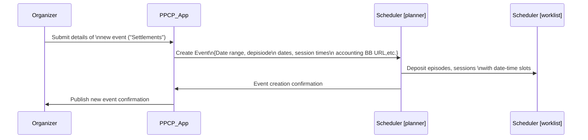
```mermaid
sequenceDiagram

Organizer->>PPCP_App: Submit details of \nnew event ("Settlements")
PPCP_App->>Scheduler [planner]:Create Event\n{Date range, depisiode\n dates, session times\n accounting BB URL,etc.}
Scheduler [planner]->>Scheduler [worklist]: Deposit episodes, sessions \nwith date-time slots 
Scheduler [planner]->>PPCP_App: Event creation confirmation
PPCP_App->>Organizer: Publish new event confirmation
```

#### Cancellation of event/session 

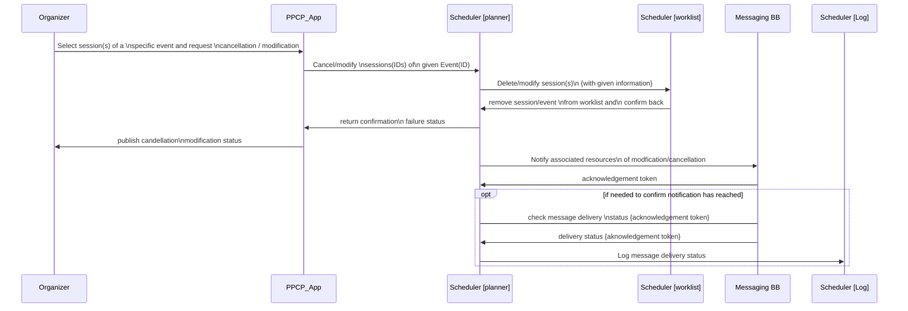
```mermaid
sequenceDiagram

Organizer->>PPCP_App:Select session(s) of a \nspecific event and request \ncancellation / modification
PPCP_App->>Scheduler [planner]: Cancel/modify \nsessions(IDs) of\n given Event(ID)
Scheduler [planner]->>Scheduler [worklist]: Delete/modify session(s)\n {with given information}
Scheduler [worklist]->>Scheduler [planner]: remove session/event \nfrom worklist and\n confirm back
Scheduler [planner]->>PPCP_App: return confirmation\n failure status
PPCP_App->>Organizer: publish candellation\nmodification status
Scheduler [planner]->>Messaging BB: Notify associated resources\n of modfication/cancellation
Messaging BB->>Scheduler [planner]: acknowledgement token
opt if needed to confirm notification has reached 
Scheduler [planner]->Messaging BB: check message delivery \nstatus {acknowledgement token}
Messaging BB->>Scheduler [planner]:delivery status {aknowledgement token}
Scheduler [planner]->>Scheduler [Log]:Log message delivery status
end 
```

#### Event tracking and Alerting

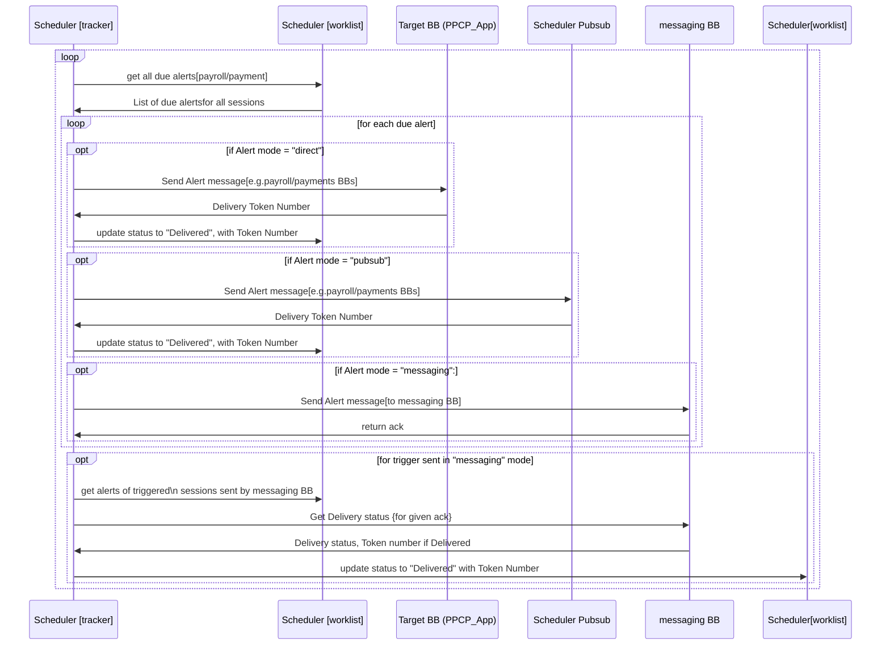
```mermaid
sequenceDiagram

loop
    Scheduler [tracker]->>Scheduler [worklist]:get all due alerts[payroll/payment] 
    Scheduler [worklist]->>Scheduler [tracker]: List of due alertsfor all sessions
    loop for each due alert
        opt if Alert mode = "direct"
            Scheduler [tracker]->>Target BB (PPCP_App): Send Alert message[e.g.payroll/payments BBs] 
            Target BB (PPCP_App)->>Scheduler [tracker]: Delivery Token Number
            Scheduler [tracker]->>Scheduler [worklist]: update status to "Delivered", with Token Number
        end
        opt if Alert mode = "pubsub"
            Scheduler [tracker]->>Scheduler Pubsub: Send Alert message[e.g.payroll/payments BBs] 
            Scheduler Pubsub->>Scheduler [tracker]: Delivery Token Number
            Scheduler [tracker]->>Scheduler [worklist]: update status to "Delivered", with Token Number
        end
        opt if Alert mode = "messaging":
            Scheduler [tracker]->>messaging BB: Send Alert message[to messaging BB]
            messaging BB->>Scheduler [tracker]: return ack
        end
    end
  Opt for trigger sent in "messaging" mode
    Scheduler [tracker]->>Scheduler [worklist]:get alerts of triggered\n sessions sent by messaging BB 
    Scheduler [tracker]->>messaging BB: Get Delivery status {for given ack}
    messaging BB->>Scheduler [tracker]: Delivery status, Token number if Delivered
    Scheduler [tracker]->>Scheduler[worklist]: update status to "Delivered" with Token Number
  end
end
```

#### Payroll/Payment session Status Update and reporting

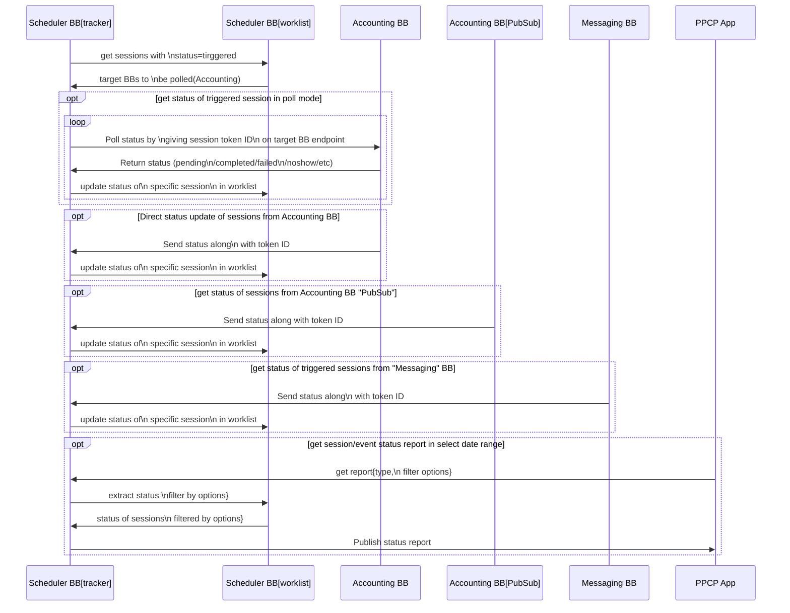
```mermaid
sequenceDiagram

Scheduler BB[tracker]->>Scheduler BB[worklist]:get sessions with \nstatus=tirggered
Scheduler BB[worklist]->>Scheduler BB[tracker]: target BBs to \nbe polled(Accounting) 
opt get status of triggered session in poll mode
    loop
        Scheduler BB[tracker]->>Accounting BB: Poll status by \ngiving session token ID\n on target BB endpoint 
        Accounting BB->>Scheduler BB[tracker]: Return status (pending\n/completed/failed\n/noshow/etc)
        Scheduler BB[tracker]->>Scheduler BB[worklist]: update status of\n specific session\n in worklist
    end
end
opt Direct status update of sessions from Accounting BB
    Accounting BB->>Scheduler BB[tracker]: Send status along\n with token ID 
    Scheduler BB[tracker]->>Scheduler BB[worklist]: update status of\n specific session\n in worklist
end

opt get status of sessions from Accounting BB "PubSub"
    Accounting BB[PubSub]->>Scheduler BB[tracker]: Send status along with token ID 
    Scheduler BB[tracker]->>Scheduler BB[worklist]: update status of\n specific session\n in worklist
end
opt get status of triggered sessions from "Messaging" BB
    Messaging BB->>Scheduler BB[tracker]: Send status along\n with token ID 
    Scheduler BB[tracker]->>Scheduler BB[worklist]: update status of\n specific session\n in worklist
end
opt get session/event status report in select date range
    PPCP App->>Scheduler BB[tracker]:get report{type,\n filter options}
    Scheduler BB[tracker]->>Scheduler BB[worklist]:extract status \nfilter by options}
     Scheduler BB[worklist]->>Scheduler BB[tracker]:status of sessions\n filtered by options}
     Scheduler BB[tracker]->>PPCP App:Publish status report 
end
```

### UC1- workflow of Event scheduling for consultation services 

<figure>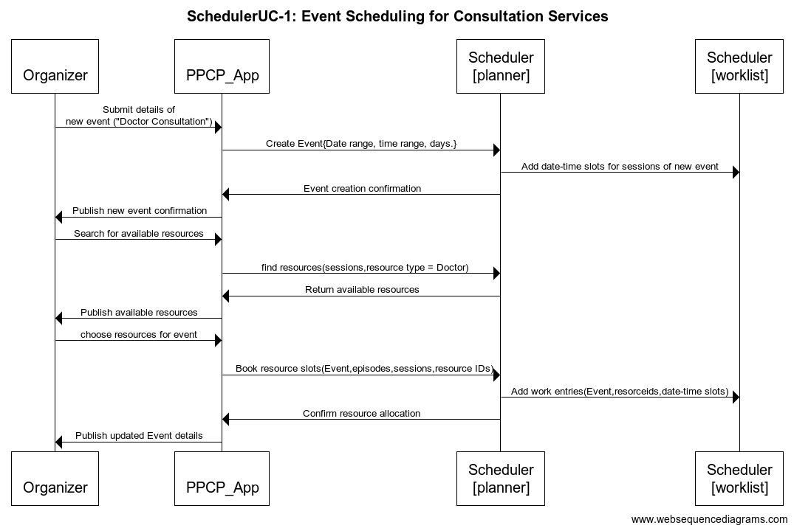<figcaption></figcaption></figure>

### UC1- workflow of Appointment booking for consultation

<figure>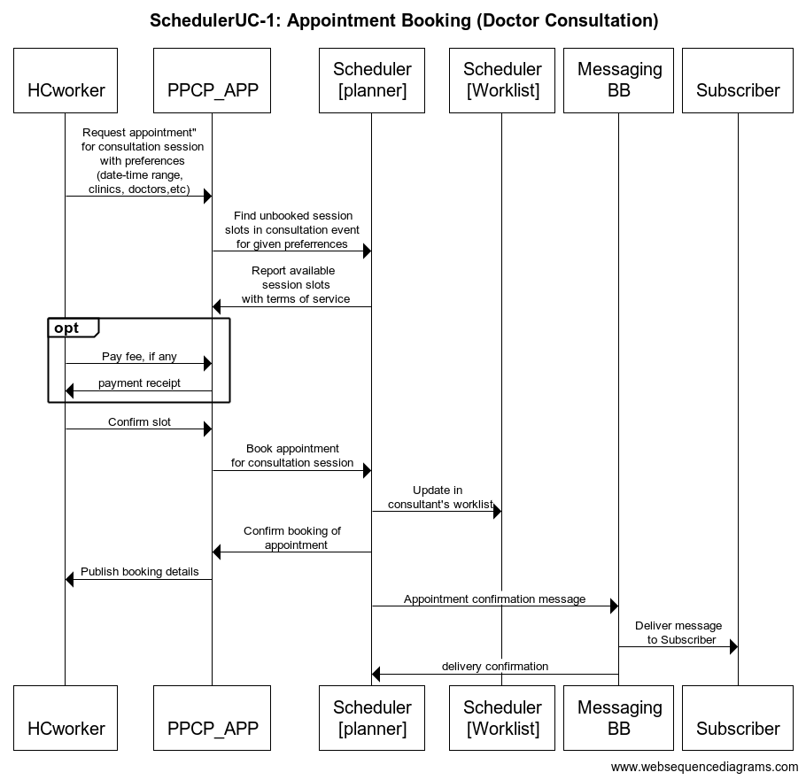<figcaption></figcaption></figure>

### UC1- workflow of cancellation of booked appointment for consultation session

<figure>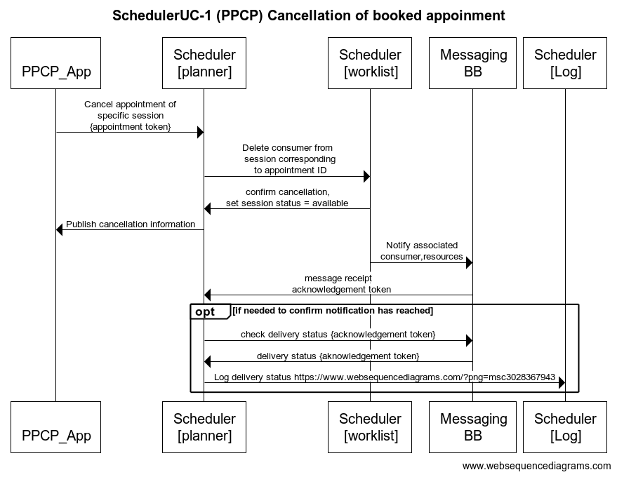<figcaption></figcaption></figure>

### UC1- Consultation Session tracking and Alerting workflow

<figure>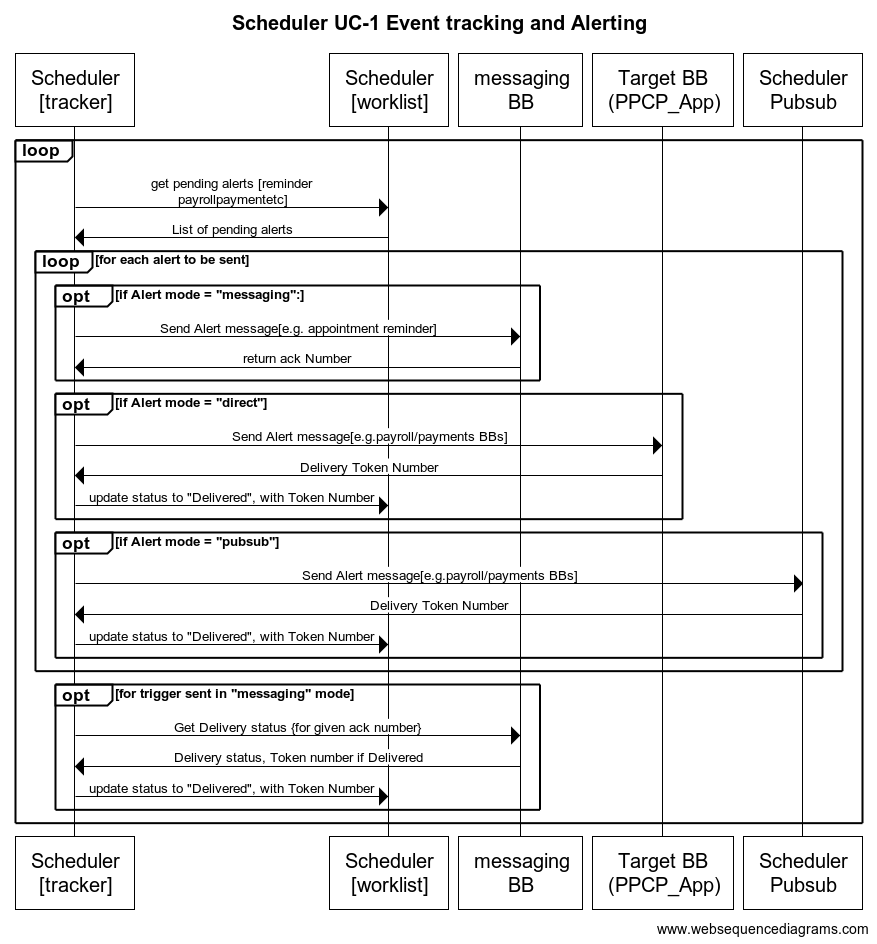<figcaption></figcaption></figure>

### UC1- Session status update and reporting workflow

<figure>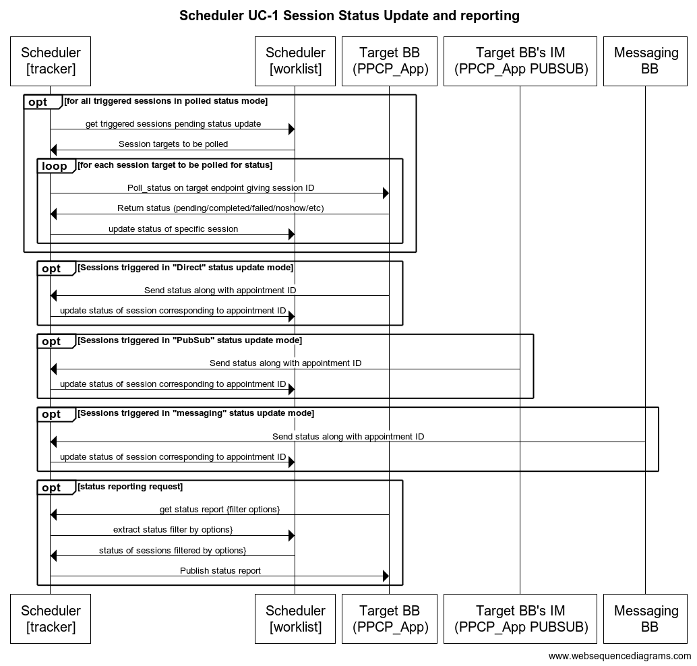<figcaption></figcaption></figure>

### UC2- Scheduling workflow for Periodic Event with Payroll and Payment Sessions

<figure>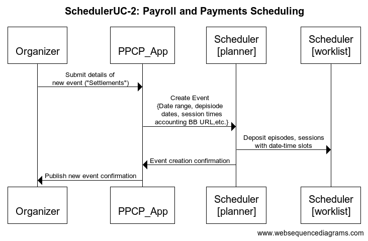<figcaption></figcaption></figure>

### UC2- Workflow for cancelling Payroll/Payments session

<figure>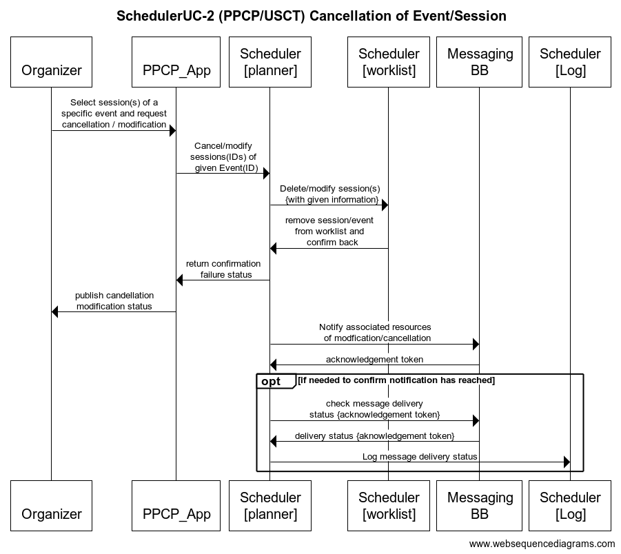<figcaption></figcaption></figure>

### UC2- Payroll/Payment Event tracking and Alerting

<figure>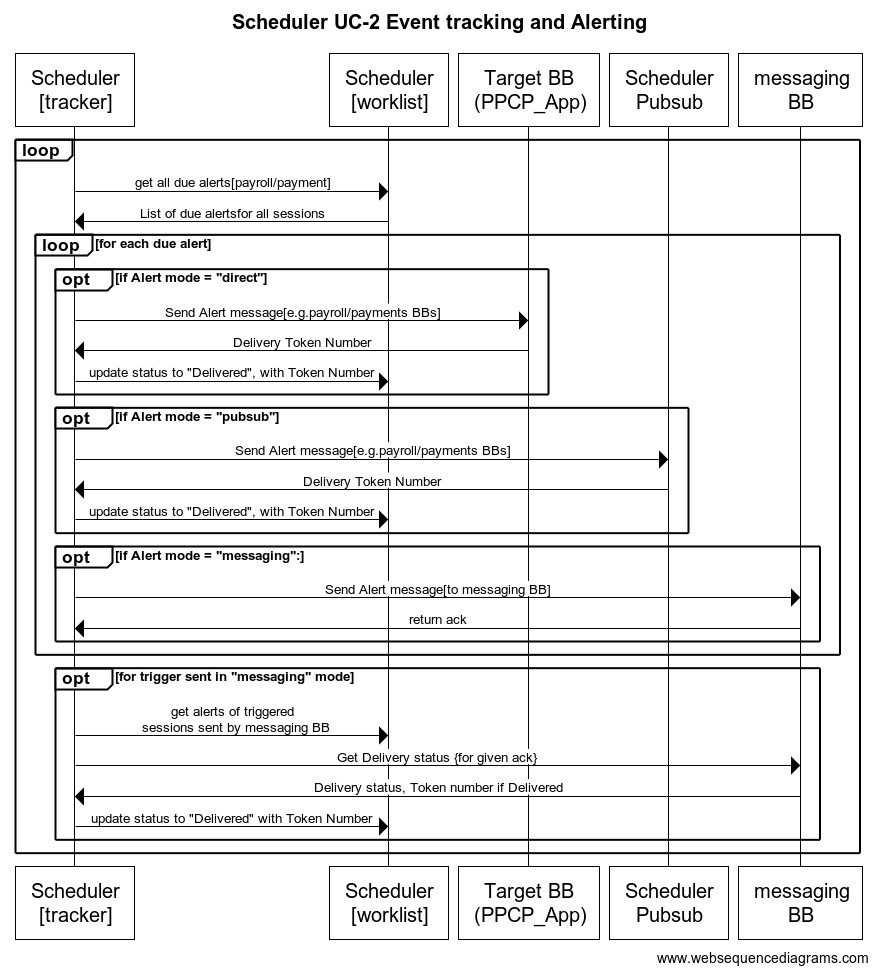<figcaption></figcaption></figure>

### UC2-Payroll/Payment Session Status tracking and Reporting

<figure>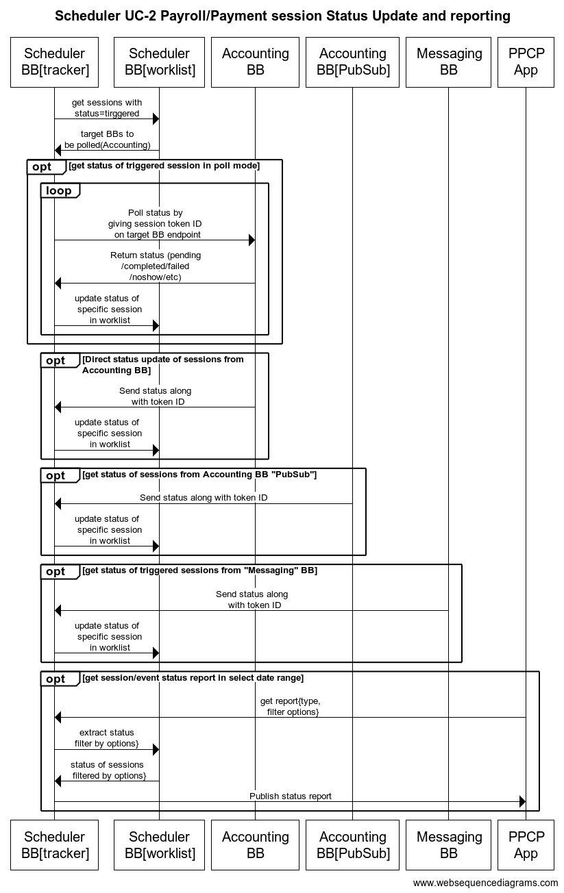<figcaption></figcaption></figure>
